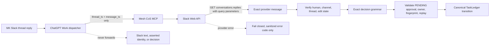

# Mesh CoS MCP v4.2.2 Slack Provider Transport Repair

## Release identity

- Deployment release: `4.2.2`
- Canonical MCP runtime contract: `4.0.0`
- Production predecessor: `4.2.1`
- Workforce: exactly 10 registered agents
- Governed MCP tool surface: unchanged
- Remote transport: OpenAI Secure MCP Tunnel
- Slack HITL mode: `CHATGPT_NATIVE_EVENT_TRIGGER`

## Patch objective

v4.2.2 repairs the second production-acceptance defect discovered in the ChatGPT-native Slack HITL path.

Production diagnostics proved that the Slack bot credential and exact message locators work when `conversations.replies` is called as GET/query, but v4.2.1 routes every Slack Web API method through a generic POST/JSON transport. Slack rejected that exact POST with `invalid_arguments`, reporting that `channel` and `ts` were missing. The server therefore failed before provider decision parsing and correctly left the canonical approval PENDING.

v4.2.2 makes the smallest causal correction: Slack read methods used by this boundary use authenticated GET/query transport while Slack write methods remain POST/JSON.

## Provider reconciliation flow

This Mermaid source was validated with Mermaid Chart during release preparation.

## Changes

1. `conversations.replies` uses HTTP GET with `channel`, `ts`, `oldest`, `latest`, `inclusive`, and `limit` in the query string.
2. `conversations.history` uses the same GET/query transport for the deployment provider-read readiness probe.
3. `chat.postMessage` and `chat.update` remain POST/JSON.
4. Slack provider rejection diagnostics preserve only a safe machine error code such as `missing_scope` or `invalid_arguments`; response metadata and credential-bearing request details are not surfaced.
5. The verified Slack App ID is corrected to `A0B49RNE4K0` across runtime readiness, production preflight, QNAP environment generation, examples, and tests.
6. QNAP deployment verification now performs a live provider-read probe from the running `mesh-cos-mcp` container. Missing bot `groups:history`, stale OAuth authorization, invalid credentials, or missing private-channel access block deployment verification before ChatGPT acceptance.
7. The Slack manifest remains least privilege for this path: `chat:write` and `groups:history`.
8. v4.2.1 decision compatibility remains intact, including one whole-message Slack bold wrapper such as `*APPROVE*` followed by the exact APPROVE / DENY / CHANGE grammar.
9. No Socket Mode, `xapp-` credential, polling loop, alternate approval path, or new public MCP tool is introduced.

## Dispatcher impact

No dispatcher trigger or payload change is required. The production task should remain one persistent event-triggered dispatcher with the first prompt line:

`Act as the production Mesh Slack HITL Dispatcher for Mesh CoS MCP v4.x.`

The version-family label is intentional because the dispatcher contract does not change with compatible patch releases. The dispatcher must continue to pass only `thread_ts` and `message_ts` and must never interpret or forward Slack message text or authority-bearing fields.

## Slack operational prerequisite

The installed dedicated bot must have these Bot Token Scopes:

- `chat:write`
- `groups:history`

If `groups:history` is newly added, Slack workspace reauthorization/reinstallation is required and the resulting `xoxb-` Bot User OAuth Token must be reprovisioned to QNAP. v4.2.2 deployment verification checks the actual mounted runtime credential against the governed private channel so scope drift is detected before acceptance.

## Production incident regression proof

The production RED evidence was:

- same `xoxb` + same locators + GET/query `conversations.replies` => `ok:true` and exact MK `*APPROVE*` provider message;
- same `xoxb` + same locators + v4.2.1 POST/JSON => `ok:false`, `error=invalid_arguments`, required `channel` and `ts` reported missing;
- direct v4.2.1 Python reconciliation fails in `_default_transport` before parser execution;
- canonical approval remains PENDING and no consequential action executes.

The v4.2.2 regression tests encode this transport distinction.

## Release artifacts

The immutable release contains the QNAP ZIP/checksum plus versioned manifest, BDD contract, security review, dispatcher guide, production acceptance guide, verification receipt, and changelog. Release metadata is bound to the exact merge SHA.

## Production acceptance

Repository CI can prove transport behavior, authority invariants, packaging, build provenance, and deployment verification logic. It cannot prove the live ChatGPT Work event trigger. After deployment, create a fresh synthetic approval and rerun the full Slack reply -> Work dispatcher -> published MCP -> QNAP provider reread -> canonical TaskLedger sequence before consequential HITL use.

## Rollback

Rollback restores the complete prior immutable release. Do not mix v4.2.2 source with a prior release root. If rollback returns to v4.2.1, governed Slack HITL remains non-accepted because v4.2.1 contains the confirmed provider transport defect.
