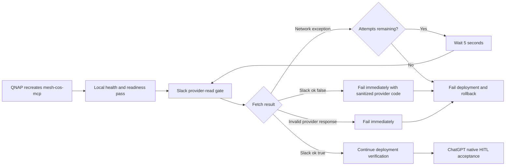

# Mesh CoS MCP v4.2.3 QNAP qnet Egress Readiness

## Release identity

- Deployment release: `4.2.3`
- Canonical MCP runtime contract: `4.0.0`
- Production predecessor: `4.2.2`
- Workforce: exactly 10 registered agents
- Governed MCP tool surface: unchanged
- Remote transport: OpenAI Secure MCP Tunnel
- Slack HITL mode: `CHATGPT_NATIVE_EVENT_TRIGGER`

## Patch objective

v4.2.3 repairs a QNAP deployment-verification race discovered while deploying v4.2.2.

Two consecutive v4.2.2 deployment attempts built and started the correct image, reached healthy local containers, promoted the candidate configuration, and then failed the first outbound Slack provider-read check with `network_error`. The deployment correctly rolled back to v4.2.1 each time.

A falsifying diagnostic then launched the exact v4.2.2 image with the same protected Slack bot token while sharing the already-stable v4.2.1 `mesh-cos-mcp` network namespace. `conversations.history` immediately returned `ok:true`. This proves the image, Slack credential, scopes, channel membership, and Slack GET/query contract are valid and isolates the defect to external egress readiness of a freshly recreated QNAP/qnet container namespace.

v4.2.3 makes the smallest causal correction: the deployment Slack provider-read gate retries only transport-level network exceptions with bounded backoff. Any actual Slack response that is not successful remains an immediate hard failure.

## Egress readiness flow

This Mermaid source was validated with Mermaid Chart during release preparation.

## Changes

1. The QNAP Slack provider-read gate permits up to six attempts.
2. Retry delay is five seconds between network-level failures.
3. Retries occur only when `fetch()` fails before a provider response is obtained.
4. Slack `ok:false` responses such as `missing_scope`, `invalid_auth`, `not_in_channel`, or `channel_not_found` fail immediately.
5. Invalid or malformed provider responses fail immediately.
6. Sanitized logs record only retry attempt metadata and safe provider error codes.
7. v4.2.2 GET/query transport for `conversations.replies` and `conversations.history` remains unchanged.
8. Slack App ID remains `A0B49RNE4K0`.
9. No new Slack OAuth scopes, Socket Mode, `xapp-` credential, polling loop, alternate approval path, MCP tool, or agent is introduced.

## Dispatcher impact

No dispatcher trigger or payload change is required. The production dispatcher remains version-family pinned:

`Act as the production Mesh Slack HITL Dispatcher for Mesh CoS MCP v4.x.`

It continues to pass only `thread_ts` and `message_ts`. It must not interpret or forward Slack message text, decisions, asserted identity, TaskLedger state, approval status, or consequential instructions.

## Security behavior

The retry does not weaken authorization or fail-closed behavior. A network exception contains no provider authority signal and is therefore eligible for bounded retry. Once Slack returns a response, that response is authoritative provider evidence for the transport attempt and any failure terminates verification immediately. If network access never becomes ready within the bounded window, deployment fails and transactional rollback restores the prior active release.

## Production acceptance

Repository CI can verify retry semantics, shell validity, packaging, security invariants, image provenance, and the unchanged MCP authority contract. It cannot prove the live QNAP/qnet timing behavior or ChatGPT Work event trigger. After deployment, v4.2.3 must pass local QNAP verification and then a fresh end-to-end synthetic Slack HITL acceptance before consequential HITL use.

## Rollback

Rollback restores the complete prior immutable release. Do not mix v4.2.3 source with an earlier release root. If rollback returns to v4.2.1, native Slack HITL remains non-accepted because v4.2.1 contains the confirmed POST/JSON provider-read defect. v4.2.2 contains the provider transport repair but is not deployable on this QNAP until the qnet egress-readiness race is addressed.
