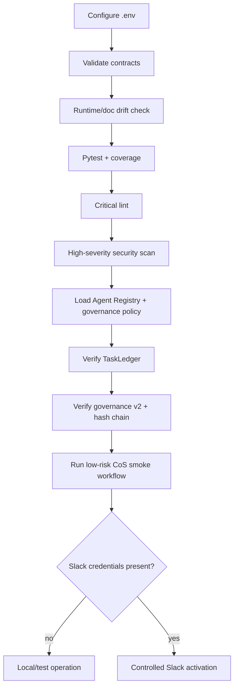
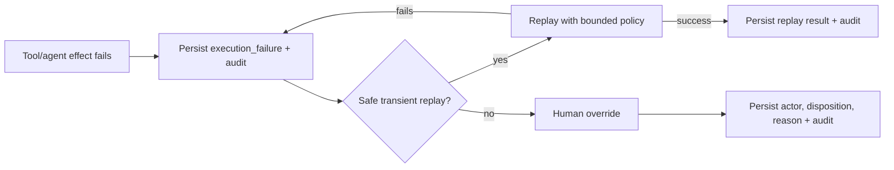

# Operations Runbook

## Startup path



## Configuration

Known non-secret Slack configuration:

```text
MESH_COS_SLACK_AGENT_OPS_CHANNEL_ID=C0BRL4GCL3A
MESH_COS_SLACK_ANSWER_DESK_CHANNEL_ID=
```

Governance Sheet identifiers are versioned in `config/governance-logs.v1.json`:

```text
CoS Decision Log = 1IJcwPuulqsNAa1lCW2MsmNgH6Vm5INPqTlcH4NR0xpw
CoS Audit Log    = 1T8vKx4gaUJdeG8kSc18MsBbXpY4EbDF3exZ0RGpvND0
```

These are non-secret identifiers. Authentication material for Google Sheets, Slack, or authoritative Mesh sources must never be committed or copied into the governance registers.

## Pre-start verification

```bash
python3 -m venv .venv
source .venv/bin/activate
pip install -e '.[dev]'
python -m pip check
python scripts/validate-contracts.py
python scripts/check-runtime-doc-drift.py
ruff check src tests scripts --select E9,F63,F7,F82
pytest --cov=mesh_cos --cov-report=term-missing --cov-fail-under=55
bandit -q -r src -lll
python -m compileall -q src
```

Do not activate a known failing build.

## Governance preflight

Before enabling agent execution:

1. Confirm every loaded agent includes `governance-journal`, `decision.v2`, and `agent-event.v2` through the shared governance policy.
2. Create a non-production `decision.v2` record and validate it against the schema.
3. Create at least two `agent-event.v2` records and confirm `verify_audit_chain()` succeeds.
4. Confirm L4/L5 decision recording fails closed without approval reference and approver.
5. Confirm the configured CoS Decision Log and CoS Audit Log IDs match `config/governance-logs.v1.json`.
6. If an automatic Sheet mirror adapter is enabled, test it with non-sensitive data and verify canonical state exists before the Sheet row.
7. Confirm a simulated mirror failure creates a durable `governance_mirror_failure` record without rolling back canonical state.

## CoS smoke workflow

1. Create an idempotent intake task.
2. Decompose it into bounded child work packages.
3. Persist delegation and dependency relationships.
4. Advance work through triage, planning, assignment, and execution.
5. Record a check-in and evidence.
6. Confirm dependency gating prevents premature work.
7. For a material recommendation, create an explainable `decision.v2` record with evidence, alternatives, criteria, confidence, risk, authority, and reversal conditions.
8. Confirm consequential agent/skill actions emit `agent-event.v2` audit records.
9. Complete and execute the acceptance test.
10. Confirm pass reaches `VERIFIED` then `CLOSED` and update decision outcome state where applicable.
11. Confirm failure routes to `REWORK`.
12. Reload tasks, decisions, verification, delegation, and audit state from `TaskLedger`.

## Governance reconciliation

The Google Sheets are human-readable operational mirrors. Reconcile them to canonical records using `decision_id`, `event_id`, `correlation_id`, and `canonical_record_ref`.

- **Decision Log:** confirm lifecycle state, approval evidence, outcome status, supersession/reversal lineage, and `record_hash` match the canonical `decision_v2` record.
- **Audit Log:** confirm sequence, event identity, result, authority, evidence, and hash-chain values match canonical `audit_event_v2` records.
- Never resolve a discrepancy by silently editing canonical history to match a Sheet.
- Correct the mirror from canonical state and create an auditable reconciliation/correction event.
- A hash-chain failure is an integrity incident and must be investigated before treating downstream audit data as complete.

## Management cycle

Run `ChiefOfStaffWorkforceManager.management_cycle()` on the configured operating cadence. Review stalled work, workload/concurrency signals, missed check-ins, governance mirror failures, decision outcomes requiring review, and any remediation. Delegated work remains visible until verified, cancelled, or explicitly superseded.

## Slack smoke test

For `#mesh-agent-ops` (`C0BRL4GCL3A`), verify a valid HMAC-signed request, reject a stale request, create one top-level task thread, confirm repeated thread creation reuses the mapping, replay the same event ID and confirm it is ignored, parse a structured message, and issue an approval notification into the task thread. If the Answer Desk channel is configured, confirm team questions use only that separate channel.

## Failure, replay, and human override



Do not replay an irreversible external effect unless its idempotency and approval conditions are explicitly safe.

## Critical incident path

```mermaid
flowchart LR
    D[Critical defect / unauthorized behavior] --> KILL[Enable kill switch if needed]
    KILL --> PRESERVE[Preserve canonical evidence + hashes]
    PRESERVE --> QUAR[Quarantine/restrict affected agent]
    QUAR --> FIX[Test-first correction]
    FIX --> CI[Full release gates]
    CI -->|pass| REVIEW[Authority, approval, decision and audit review]
    REVIEW --> RESTORE[Controlled restoration]
    CI -->|fail| FIX
```



Material external, security, privacy, legal, regulatory, personnel, commercial, or authority consequences escalate to the appropriate human decision owner.

## Shutdown and restoration

`MESH_COS_KILL_SWITCH=true` prevents automated CoS operating actions that use the runtime guard. Shutdown must preserve canonical state. Restore routing only after root cause, regression tests, registry/policy changes, governance-log integrity, and approval boundaries are validated.

## Production dependencies

Approved source/skill credentials, the separate Answer Desk channel ID, production approval-owner mapping, deployment infrastructure, authenticated Google Sheets access for automatic mirroring, and any future thresholds explicitly approved by Michael remain environment-specific.
