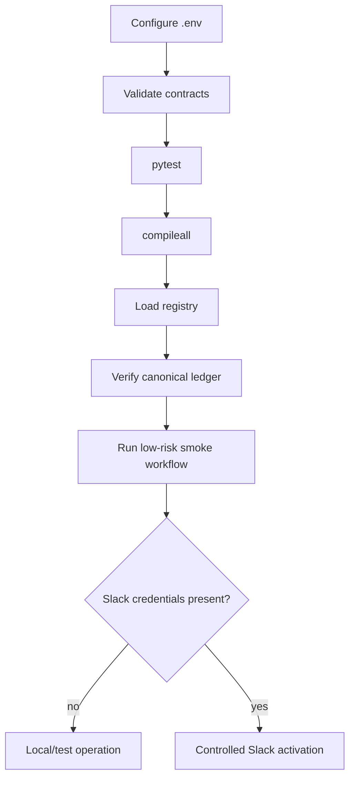
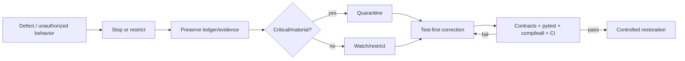

# Operations Runbook

## Startup path



## Configuration

Known non-secret Slack configuration:

```text
MESH_COS_SLACK_AGENT_OPS_CHANNEL_ID=C0BRL4GCL3A
```

Live Slack also requires `MESH_COS_SLACK_BOT_TOKEN` and `MESH_COS_SLACK_SIGNING_SECRET`. The separate Answer Desk channel ID is not yet configured. Never commit secrets or personal Slack IDs.

## Pre-start verification

```bash
python3 -m venv .venv
source .venv/bin/activate
pip install -e '.[dev]'
python scripts/validate-contracts.py
pytest
python -m compileall -q src
```

Do not activate a known failing build.

## Smoke workflow

1. Create an intake task.
2. Advance through triage, planning, assignment, and execution.
3. Record evidence and completion.
4. Execute the acceptance check.
5. Confirm pass reaches `VERIFIED`.
6. Confirm failure routes to `REWORK`.
7. Reload task, verification, and audit state from the ledger.

## Slack smoke test

For `#mesh-agent-ops` (`C0BRL4GCL3A`), verify request signing, bind a test task to a thread, confirm the mapping survives a new coordinator instance, replay the same event ID, and confirm duplicate processing is rejected.

## Incident path



Material external, security, privacy, legal, regulatory, personnel, or commercial consequence must escalate to the appropriate human authority.

## Shutdown and restoration

Keep the kill switch available. Shutdown must preserve canonical state. Restore routing only after the root cause is fixed, regression tests pass, policy/registry changes are validated, and no authority or approval boundary was weakened.

## Remaining production dependencies

Approved source/skill credentials, Answer Desk channel ID, production approval-owner mapping, deployment infrastructure, and any future thresholds explicitly approved by Michael.
