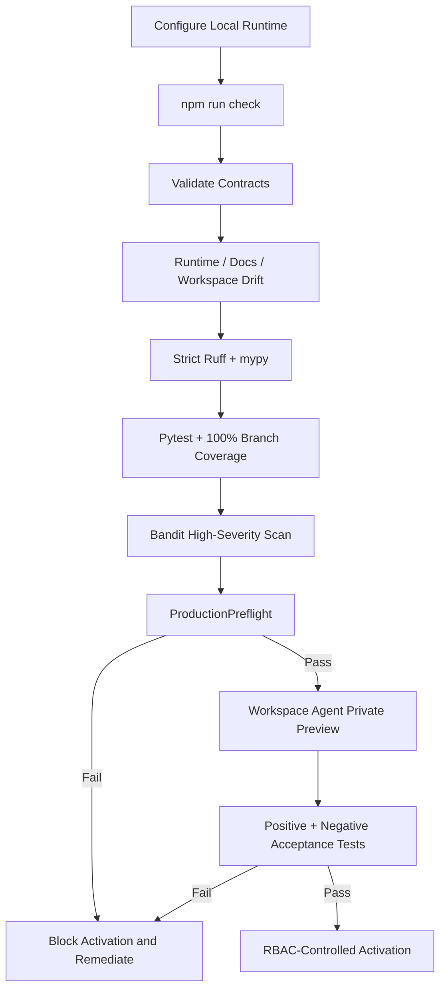

# Operations Runbook

Current repository release target: **`v2.0.0 Shared Mesh Devil's Advocate`**.

This runbook distinguishes repository readiness from target-environment activation. ChatGPT operation uses the bundled local stdio MCP. A separately deployed HTTPS MCP service is not required.

## Startup and activation path



## Local runtime configuration

```text
MESH_COS_AGENT_ID=cos
MESH_COS_LEDGER_PATH=.mesh-cos/task-ledger.sqlite3
MESH_COS_PYTHON_BIN=python
MESH_COS_SLACK_AGENT_OPS_CHANNEL_ID=C0BRL4GCL3A
MESH_COS_SLACK_ANSWER_DESK_CHANNEL_ID=
```

Each Workspace Agent gets its own registered `MESH_COS_AGENT_ID`. All **10 agents** in the same CoS operating universe use the same approved `MESH_COS_LEDGER_PATH`.

Authentication credentials, OAuth tokens, Slack secrets, API keys, service-account credentials, and source credentials remain outside source control.

Governance Sheet identifiers:

```text
CoS Decision Log = 1IJcwPuulqsNAa1lCW2MsmNgH6Vm5INPqTlcH4NR0xpw
CoS Audit Log    = 1T8vKx4gaUJdeG8kSc18MsBbXpY4EbDF3exZ0RGpvND0
```

The Sheets are mirrors. `TaskLedger` remains canonical.

## Workforce and shared challenge model

The runtime contains 10 registered agent principals: Chief of Staff, AgentOps Controller, Answer & Decision Desk, CRO, CFO, COO, Consultant Network Steward, CMO, VP Content, and Message Operations.

**Mesh Devil's Advocate** is not a registered agent principal. It is an external **shared Skill** available only to Chief of Staff and CRO through governed Skill invocation. It is advisory-only, cannot own tasks, cannot modify canonical facts, cannot execute external actions, and returns decision authority to the owning role or qualified human.

For commercial work, Revenue Intelligence remains canonical for account identity, evidence classes, scores, stage, lifecycle, queue state, activation readiness, and prioritization. The shared challenge Skill may test reasoning, assumptions, sufficiency, route, capacity, and decision conditions without rewriting those facts.

## Release verification

```bash
python3 -m venv .venv
source .venv/bin/activate
pip install -e '.[dev]'
python -m pip check
cd mcp
npm ci
npm run check
cd ..
python scripts/validate-contracts.py
python scripts/check-runtime-doc-drift.py
python scripts/check-chatgpt-packages.py
ruff check src
ruff check tests scripts --select E9,F63,F7,F82
mypy src --check-untyped-defs
pytest --cov=mesh_cos --cov-report=term-missing --cov-report=xml --cov-fail-under=100
bandit -q -r src -lll
python -m compileall -q src
```

Do not activate or publish a known failing build.

## Local MCP certification

`npm run check` must pass before Workspace Agent activation. It verifies:

- TypeScript compilation;
- Node MCP unit tests;
- a real stdio MCP handshake and tool listing;
- exact per-agent tool projection;
- exclusion of human-only tools;
- a canonical task write/read across separate MCP calls;
- safe denial behavior;
- npm audit at high severity.

The checked-in entry point is:

```text
node mcp/dist/index.js
```

The TypeScript runtime bridges to `mesh_cos.mcp_stdio_bridge`, which dispatches through `mesh_cos.mcp_runtime.MCPRuntime`.

## Production preflight

Run before activation:

```bash
python scripts/production-preflight.py
```

When relevant:

```bash
python scripts/production-preflight.py --require-slack --require-answer-desk --require-ledger
```

A failed preflight is a blocker. Do not bypass it by weakening a test or policy.

## Workspace Agent package preflight

Before configuring the 10 Workspace Agents:

1. Confirm release `2.0.0` is aligned in `pyproject.toml`, `mesh_cos.__version__`, all Workspace Agent manifests, and `mesh-cos-mcp.v1.json`.
2. Confirm every manifest declares `LOCAL_STDIO`, `node`, `mcp/dist/index.js`, the correct `MESH_COS_AGENT_ID`, and the shared approved `MESH_COS_LEDGER_PATH`.
3. Confirm each repository-local role Skill contains `SKILL.md`, `agents/openai.yaml`, `references/role-contract.md`, and `references/production-readiness.md`.
4. Confirm the repository-local `devils-advocate` role card, Workspace Agent manifest, MCP principal, and duplicate `chatgpt/skills/mesh-devils-advocate/` package are absent.
5. Confirm Chief of Staff and CRO alone carry the `mesh-devils-advocate` shared capability entitlement and `skills.invoke_governed` permission.
6. Run `python scripts/check-chatgpt-packages.py` and require `ChatGPT Workspace Agent package drift check: OK`.
7. Confirm `WorkspaceAgentMCPPolicy.validate_runtime_bindings()` returns no unresolved bindings.
8. Confirm `approval.record_decision` and `reliability.human_override` are human-only and excluded from all agent allowlists.
9. Confirm only CoS has `task.reassign`.
10. Confirm Answer Desk Slack remains disabled until a dedicated channel ID exists.
11. Confirm existing connector constraints remain intact.

## Workspace Agent procedure

Use `chatgpt/workspace-agent-builder-prompt.md`. For each agent:

1. Apply `builder_configuration` exactly.
2. Attach the matching repository-local role Skill and only listed knowledge files.
3. Attach the shared Mesh Devil's Advocate Skill only to Chief of Staff and CRO.
4. Configure `mesh-cos-mcp` as the bundled `LOCAL_STDIO` runtime.
5. Launch `node mcp/dist/index.js` with the manifest's MCP environment.
6. Enable only the declared MCP tools.
7. Connect only manifest-listed Workspace apps with least privilege.
8. Keep Workspace write approval at **Always ask** unless an explicit reviewed exception exists.
9. Apply every Connector Action Constraint exactly.
10. Keep the agent Private while preview tests run.
11. Do not enable Answer Desk Slack without its dedicated channel ID.

Do not invent `MESH_COS_MCP_SERVER_URL`. It is not required by the local runtime.

## Preview acceptance tests

For every agent, run all three starter prompts plus one positive in-scope execution, negative authority, missing-evidence, MCP permission-denial, human-approval spoofing, connector constraint where applicable, kill-switch denial, replay-safety, and completion-versus-verification test where applicable.

For Chief of Staff and CRO, also test governed invocation of Mesh Devil's Advocate, confirm the challenge output is advisory, confirm canonical facts remain unchanged, and confirm no external action can be taken by the shared Skill.

For CoS, additionally test decomposition, dependency gating, reassignment, stalled-work remediation, L4 approval, L5 escalation, human-only tool denial, and evidence-backed verification.

For Message Operations, verify missing or mismatched approval blocks execution and that valid Mesh approval still encounters Workspace **Always ask** before a consequential send.

## Completion and verification

`task.complete` persists accountable-owner outcome evidence. `task.verify` remains a separate acceptance action. `COMPLETED` is not `VERIFIED`.

## Failure and incident path

A critical defect, MCP allowlist bypass, local identity-binding failure, human-principal spoofing attempt, governance hash failure, L4/L5 breach, unsafe replay attempt, or shared-Skill authority violation should stop execution, preserve canonical evidence, enable the kill switch if needed, restrict the affected agent, fix through tests first, rerun full CI and MCP certification, rerun private-preview tests, and restore only under controlled approval.

## Release and activation

`v2.0.0` is the semantic release for the 10-agent plus shared Mesh Devil's Advocate architecture. See `release-2.0.0-shared-devils-advocate.md` and `../RELEASE.md`.

Production activation dependencies still include Workspace authentication and least-privilege app permissions, applicable Slack credentials, a separate Answer Desk Slack channel, production approval-owner mapping, approved source/Skill credentials, secrets management, monitoring, authenticated Google Sheets access if automatic mirroring is enabled, and target-workspace publication/RBAC configuration.

A remote MCP service is optional, not required.
