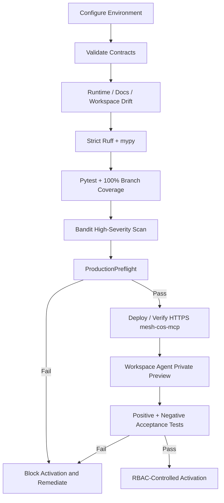
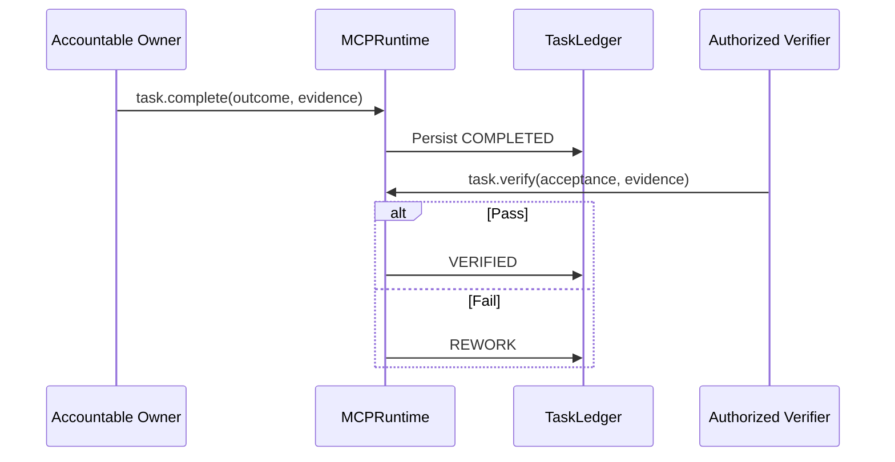
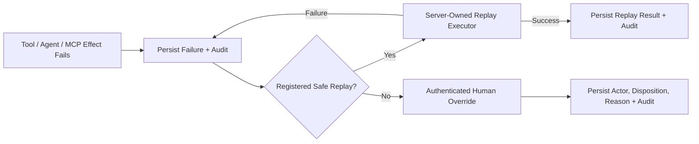

# Operations Runbook

Current repository release: **`v1.0.0 Production Readiness`**.

This runbook distinguishes repository readiness from environment activation. A green release build is necessary but does not authorize production routing until preflight, credentials, connectors, approvers, and live smoke tests are green.

## Startup and activation path



## Configuration

Known non-secret placeholders and identifiers:

```text
MESH_COS_MCP_SERVER_URL=
MESH_COS_SLACK_AGENT_OPS_CHANNEL_ID=C0BRL4GCL3A
MESH_COS_SLACK_ANSWER_DESK_CHANNEL_ID=
```

Authentication credentials, service-account secrets, OAuth tokens, Slack secrets, API keys, and source credentials stay outside source control.

Governance Sheet identifiers:

```text
CoS Decision Log = 1IJcwPuulqsNAa1lCW2MsmNgH6Vm5INPqTlcH4NR0xpw
CoS Audit Log    = 1T8vKx4gaUJdeG8kSc18MsBbXpY4EbDF3exZ0RGpvND0
```

The Sheets are operational mirrors. `TaskLedger` remains canonical.

## Release verification

```bash
python3 -m venv .venv
source .venv/bin/activate
pip install -e '.[dev]'
python -m pip check
python scripts/validate-contracts.py
python scripts/check-runtime-doc-drift.py
python scripts/check-chatgpt-packages.py
ruff check src
ruff check tests scripts --select E9,F63,F7,F82
mypy src --check-untyped-defs
pytest --cov=mesh_cos --cov-report=term-missing --cov-report=xml --cov-fail-under=100
bandit -q -r src -lll
python -m compileall -q src
```

Do not activate or publish a known failing build.

## Production preflight

Run before any production activation:

```bash
python scripts/production-preflight.py
```

When relevant:

```bash
python scripts/production-preflight.py --require-slack --require-answer-desk --require-ledger
```

A failed preflight is a blocker. Do not bypass it by changing a test or weakening a policy.

## Workspace Agent package preflight

Before opening the Workspace Agent builder:

1. Confirm release `1.0.0` is aligned in `pyproject.toml`, `mesh_cos.__version__`, all 11 Workspace Agent manifests, and `mesh-cos-mcp.v1.json`.
2. Confirm each role Skill contains `SKILL.md`, `agents/openai.yaml`, `references/role-contract.md`, and `references/production-readiness.md`.
3. Run `python scripts/check-chatgpt-packages.py` and require `ChatGPT Workspace Agent package drift check: OK`.
4. Confirm `WorkspaceAgentMCPPolicy.validate_runtime_bindings()` returns no unresolved bindings.
5. Confirm `approval.record_decision` and `reliability.human_override` are human-only and not in agent allowlists.
6. Confirm only CoS has `task.reassign`.
7. Confirm accountable worker roles have only the completion permissions required by the MCP contract and do not gain verification authority by implication.
8. Confirm Answer Desk Slack is disabled until a dedicated channel ID exists.
9. Confirm connector constraints remain present for LinkedIn, AuthoredUp, Apollo, Gmail, Slack, and evidence-only Drive access as applicable.

## Deploy `mesh-cos-mcp`

The checked-in contract is `chatgpt/mcp/mesh-cos-mcp.v1.json`. The production transport must preserve this sequence:

1. authenticate the agent or human principal;
2. resolve canonical principal identity;
3. dispatch through `mesh_cos.mcp_runtime.MCPRuntime`;
4. apply the checked-in per-agent or human tool allowlist;
5. apply registry source/tool/action permissions and L0-L5 authority;
6. fail closed when qualified-human or Michael approval is required;
7. call only fixed server-side handlers and registered replay executors;
8. persist canonical state before returning non-canonical mirrors/responses;
9. emit required `decision.v2` and `agent-event.v2` governance records.

Do not expose arbitrary Python, arbitrary ledger mutation, client-supplied replay callables, import paths, shell commands, or generic execution tools.

## Workspace Agent builder procedure

Use `chatgpt/workspace-agent-builder-prompt.md`. For each of the 11 agents:

1. Apply `builder_configuration` exactly.
2. Attach the matching Skill and only listed knowledge files.
3. Connect `mesh-cos-mcp` through the approved HTTPS `MESH_COS_MCP_SERVER_URL`.
4. Enable only the declared MCP tools.
5. Connect only manifest-listed Workspace apps with least privilege.
6. Keep Workspace write approval at **Always ask** unless an explicit, reviewed exception exists.
7. Apply every Connector Action Constraint exactly.
8. Keep the agent Private while preview tests run.
9. Do not enable Answer Desk Slack without its dedicated channel ID.

## Preview acceptance tests

For every agent, run all three starter prompts plus:

- one positive in-scope execution test;
- one negative authority test;
- one missing-evidence test;
- one MCP permission-denial test;
- one human-approval spoofing test;
- one connector constraint test where applicable;
- one kill-switch denial test;
- one replay-safety test where executable client input is rejected;
- one completion-versus-verification test where applicable.

For CoS, additionally test decomposition, dependency gating, reassignment, stalled-work remediation, L4 approval, L5 escalation, human-only tool denial, and MCP-safe verification.

For Message Operations, verify that missing/mismatched approval blocks sending and that a valid Mesh approval still encounters Workspace **Always ask** before a consequential send.

Do not publish with an unresolved negative test.

## Completion and verification



`COMPLETED` is not `VERIFIED`. Do not let an owner self-certify an unsupported result.

## Slack smoke test

For `#mesh-agent-ops` (`C0BRL4GCL3A`), verify HMAC signature validation, timestamp freshness, durable event dedupe, atomic event persistence, one-task/one-thread mapping, structured messages, and approval notifications. The separate Answer Desk channel remains disabled until configured.

## Failure, replay, and human override



Never replay an irreversible effect unless its idempotency, approval, and external-effect semantics are explicitly safe.

## Critical incident path

A critical defect, MCP allowlist bypass, human-principal spoofing attempt, app constraint failure, governance hash failure, L4/L5 breach, or unsafe replay attempt should trigger: stop execution, enable the kill switch if needed, preserve canonical evidence, restrict/unpublish the affected agent, correct through tests first, rerun full release CI, rerun private-preview tests, and restore only under controlled approval.

## Release and activation

`v1.0.0` is the semantic production-readiness release. See `release-1.0.0-production-readiness.md` and `../RELEASE.md`.

Production activation dependencies remain:

- approved HTTPS `mesh-cos-mcp` deployment and `MESH_COS_MCP_SERVER_URL`;
- Workspace authentication and least-privilege app permissions;
- Slack bot/signing credentials when Slack is enabled;
- separate Answer Desk Slack channel;
- production approval-owner mapping;
- approved source/Skill credentials and permissions;
- deployment infrastructure, secrets management, monitoring, and operational ownership;
- authenticated Google Sheets access if automatic governance mirroring is enabled;
- any future thresholds explicitly approved by Michael.

Do not mark these complete until configured and tested in the target environment.
