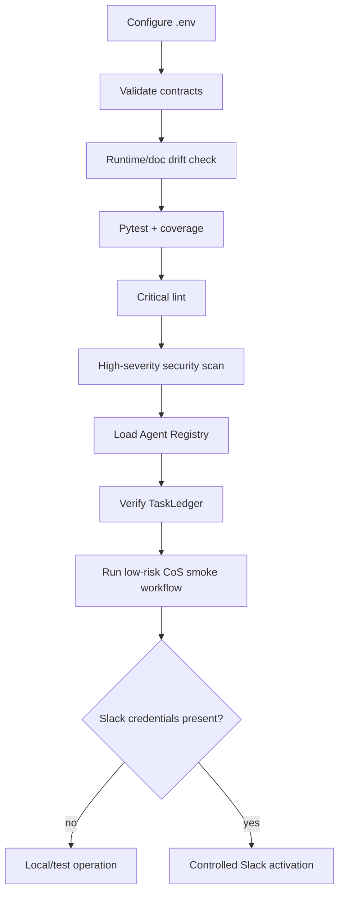
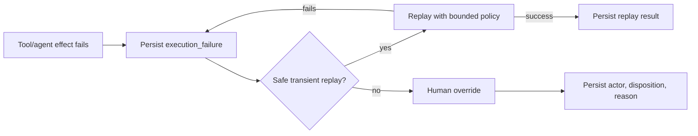

# Operations Runbook

## Startup path



## Configuration

Known non-secret Slack configuration:

```text
MESH_COS_SLACK_AGENT_OPS_CHANNEL_ID=C0BRL4GCL3A
MESH_COS_SLACK_ANSWER_DESK_CHANNEL_ID=
```

Live Slack also requires `MESH_COS_SLACK_BOT_TOKEN` and `MESH_COS_SLACK_SIGNING_SECRET`. Never commit secrets or personal Slack IDs.

## Pre-start verification

```bash
python3 -m venv .venv
source .venv/bin/activate
pip install -e '.[dev]'
python -m pip check
python scripts/validate-contracts.py
python scripts/check-runtime-doc-drift.py
ruff check src tests scripts --select E9,F63,F7,F82
pytest --cov=mesh_cos --cov-report=term-missing --cov-fail-under=55
bandit -q -r src -lll
python -m compileall -q src
```

Do not activate a known failing build.

## CoS smoke workflow

1. Create an idempotent intake task.
2. Decompose it into bounded child work packages.
3. Persist delegation and dependency relationships.
4. Advance work through triage, planning, assignment, and execution.
5. Record a check-in and evidence.
6. Confirm dependency gating prevents premature work.
7. Complete and execute the acceptance test.
8. Confirm pass reaches `VERIFIED` then `CLOSED`.
9. Confirm failure routes to `REWORK`.
10. Reload tasks, verification, delegation, and audit state from `TaskLedger`.

## Management cycle

Run `ChiefOfStaffWorkforceManager.management_cycle()` on the configured operating cadence. Review stalled work, workload/concurrency signals, missed check-ins, and any remediation. Delegated work remains visible until verified, cancelled, or explicitly superseded.

## Slack smoke test

For `#mesh-agent-ops` (`C0BRL4GCL3A`), verify a valid HMAC-signed request, reject a stale request, create one top-level task thread, confirm repeated thread creation reuses the mapping, replay the same event ID and confirm it is ignored, parse a structured message, and issue an approval notification into the task thread. If the Answer Desk channel is configured, confirm team questions use only that separate channel.

## Failure, replay, and human override



Do not replay an irreversible external effect unless its idempotency and approval conditions are explicitly safe.

## Critical incident path

```mermaid
flowchart LR
    D[Critical defect / unauthorized behavior] --> KILL[Enable kill switch if needed]
    KILL --> PRESERVE[Preserve canonical evidence]
    PRESERVE --> QUAR[Quarantine/restrict affected agent]
    QUAR --> FIX[Test-first correction]
    FIX --> CI[Full release gates]
    CI -->|pass| REVIEW[Authority and approval review]
    REVIEW --> RESTORE[Controlled restoration]
    CI -->|fail| FIX
```



Material external, security, privacy, legal, regulatory, personnel, commercial, or authority consequences escalate to the appropriate human decision owner.

## Shutdown and restoration

`MESH_COS_KILL_SWITCH=true` prevents automated CoS operating actions that use the runtime guard. Shutdown must preserve canonical state. Restore routing only after root cause, regression tests, registry/policy changes, and approval boundaries are validated.

## Production dependencies

Approved source/skill credentials, the separate Answer Desk channel ID, production approval-owner mapping, deployment infrastructure, and any future thresholds explicitly approved by Michael remain environment-specific.
