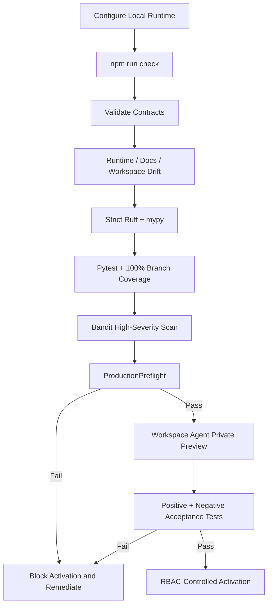

# Operations Runbook

Current repository release target: **`v3.0.0 Shared Mesh Message Operations`**.

This runbook distinguishes repository readiness from target-environment activation. ChatGPT operation uses the bundled local stdio MCP. A separately deployed HTTPS MCP service is not required.

## Startup and activation path



## Local runtime configuration

```text
MESH_COS_AGENT_ID=cos
MESH_COS_LEDGER_PATH=.mesh-cos/task-ledger.sqlite3
MESH_COS_PYTHON_BIN=python
MESH_COS_SLACK_AGENT_OPS_CHANNEL_ID=C0BRL4GCL3A
MESH_COS_SLACK_ANSWER_DESK_CHANNEL_ID=
```

Each Workspace Agent gets its own registered `MESH_COS_AGENT_ID`. All **9 agents** in the same CoS operating universe use the same approved `MESH_COS_LEDGER_PATH`. Shared Skills receive no agent identity.

Authentication credentials, OAuth tokens, Slack secrets, API keys, service-account credentials, and source credentials remain outside source control. Governance Sheets are mirrors; `TaskLedger` remains canonical.

## Workforce and shared capability model

The registered workforce contains exactly 9 agents: Chief of Staff, AgentOps Controller, Answer & Decision Desk, CRO, CFO, COO, Consultant Network Steward, CMO, and VP Content.

**Mesh Devil's Advocate** is an external shared Skill for Chief of Staff and CRO only. It is advisory only.

**Mesh Message Operations** is an external shared Skill for Chief of Staff, CRO, and CMO only. It is approval-bound execution only. VP Content remains drafting/editorial-production only.

Message Operations requires an approved packet with immutable payload hash/version; full preflight; exact preview; seed/test delivery where required; explicit current approval bound to payload, sender, immutable audience, channel, purpose, jurisdiction, consent, suppressions/frequency controls, test result, approvers, and execution window; cancellation/kill-switch recheck; documented connector action; idempotency key; per-attempt receipt; and observed provider-state verification. Material changes invalidate approval and return the item to preflight.

## Release verification

```bash
python -m pip check
cd mcp
npm ci
npm run check
cd ..
python scripts/validate-contracts.py
python scripts/check-runtime-doc-drift.py
python scripts/check-chatgpt-packages.py
ruff check src
ruff check tests scripts --select E9,F63,F7,F82
mypy src --check-untyped-defs
pytest --cov=mesh_cos --cov-report=term-missing --cov-report=xml --cov-fail-under=100
bandit -q -r src -lll
python -m compileall -q src
```

Do not activate or publish a known failing build.

## Local MCP certification

`npm run check` must pass before Workspace Agent activation. It verifies TypeScript compilation, Node unit tests, a real stdio MCP handshake/tool listing, exact 9-agent tool projection, human-only exclusion, canonical persistence across MCP calls, safe denial behavior, and npm audit at high severity.

The checked-in entry point is `node mcp/dist/index.js`, bridging to `mesh_cos.mcp_stdio_bridge` and `mesh_cos.mcp_runtime.MCPRuntime`.

## Production preflight

Run before activation:

```bash
python scripts/production-preflight.py
```

When relevant:

```bash
python scripts/production-preflight.py --require-slack --require-answer-desk --require-ledger
```

A failed preflight is a blocker. Do not bypass it by weakening a test or policy.

## Workspace Agent package preflight

Before configuring the 9 Workspace Agents:

1. Confirm release `3.0.0` is aligned in Python package/runtime, MCP package/lock metadata, MCP contract, all manifests, release docs, and workflows.
2. Confirm every manifest declares `LOCAL_STDIO`, `node`, `mcp/dist/index.js`, the correct `MESH_COS_AGENT_ID`, and the shared approved `MESH_COS_LEDGER_PATH`.
3. Confirm each repository-local role Skill includes its required package files.
4. Confirm `devils-advocate` and `message-ops` role cards, Workspace Agent manifests, MCP principals, and duplicate local shared Skill packages are absent.
5. Confirm CoS/CRO alone carry `mesh-devils-advocate` and CoS/CRO/CMO alone carry `mesh-message-operations`.
6. Confirm VP Content has no Message Operations entitlement.
7. Run `python scripts/check-chatgpt-packages.py` and require success.
8. Confirm `WorkspaceAgentMCPPolicy.validate_runtime_bindings()` returns no unresolved bindings.
9. Confirm `approval.record_decision` and `reliability.human_override` are human-only and excluded from all agent allowlists.
10. Confirm existing connector constraints remain intact.

## Workspace Agent procedure

Use `chatgpt/workspace-agent-builder-prompt.md`. For each agent, apply the manifest exactly, attach only listed role/shared Skills, configure the bundled `LOCAL_STDIO` MCP, enable only declared tools/apps, keep write actions at **Always ask** unless explicitly reviewed, and keep the agent private until preview tests pass.

Attach Mesh Devil's Advocate only to Chief of Staff and CRO. Attach Mesh Message Operations only to Chief of Staff, CRO, and CMO.

Do not invent `MESH_COS_MCP_SERVER_URL`. It is not required by the local runtime.

## Preview acceptance tests

For every agent, run starter prompts plus positive in-scope execution, negative authority, missing-evidence, MCP permission-denial, human-approval spoofing, connector constraint where applicable, kill-switch denial, replay-safety, and completion-versus-verification tests.

For CoS/CRO, test Mesh Devil's Advocate as advisory-only with canonical facts unchanged.

For CoS/CRO/CMO, test Mesh Message Operations with missing approval, mismatched payload hash, mutated audience/sender/channel/window, cancellation, kill switch, duplicate idempotency key, connector failure, receipt capture, and unobserved delivery/reply. Every invalid case must fail closed. A valid approved send must still respect Workspace **Always ask** and all caller authority gates.

## Completion and verification

`task.complete` persists accountable-owner outcome evidence. `task.verify` remains a separate acceptance action. `COMPLETED` is not `VERIFIED`. Successful connector execution is not proof of delivery or business outcome.

## Failure and incident path

A critical defect, MCP allowlist bypass, identity-binding failure, human-principal spoofing attempt, governance hash failure, L4/L5 breach, unsafe replay attempt, approval-binding defect, idempotency defect, false delivery claim, or shared-Skill authority violation should stop execution, preserve canonical evidence, enable the kill switch if needed, restrict the affected role/capability, fix through tests first, rerun full CI, rerun private-preview tests, and restore only under controlled approval.

## Release and activation

`v3.0.0` is the semantic major release for the 9-agent plus shared Mesh Devil's Advocate and Mesh Message Operations architecture. See `release-3.0.0-shared-message-operations.md` and `../RELEASE.md`.

Production activation dependencies still include Workspace authentication and least-privilege app permissions, applicable Gmail/Slack credentials, Answer Desk channel configuration, production approval-owner mapping, consent/jurisdiction decisions, approved source/shared-Skill credentials, secrets management, monitoring, and target-workspace publication/RBAC configuration.

A remote MCP service remains optional, not required.
