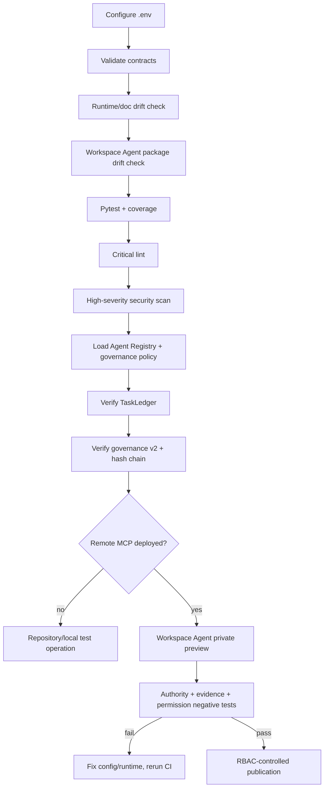
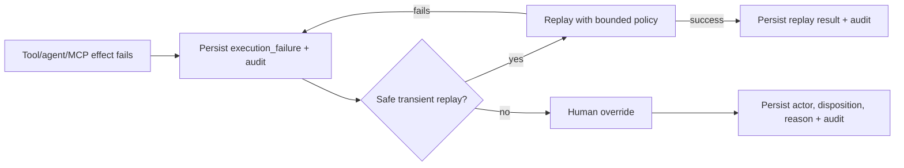

# Operations Runbook

## Startup and Workspace Agent deployment path



## Configuration

Known non-secret placeholders and identifiers:

```text
MESH_COS_MCP_SERVER_URL=
MESH_COS_SLACK_AGENT_OPS_CHANNEL_ID=C0BRL4GCL3A
MESH_COS_SLACK_ANSWER_DESK_CHANNEL_ID=
```

`MESH_COS_MCP_SERVER_URL` must point to an approved deployed HTTPS MCP endpoint. The repository does not fabricate that endpoint. Authentication credentials, service-account secrets, OAuth tokens, Slack secrets, and source credentials must remain outside source control.

Governance Sheet identifiers are versioned in `config/governance-logs.v1.json`:

```text
CoS Decision Log = 1IJcwPuulqsNAa1lCW2MsmNgH6Vm5INPqTlcH4NR0xpw
CoS Audit Log    = 1T8vKx4gaUJdeG8kSc18MsBbXpY4EbDF3exZ0RGpvND0
```

The Sheets remain operational mirrors. `TaskLedger` remains canonical.

## Pre-start verification

```bash
python3 -m venv .venv
source .venv/bin/activate
pip install -e '.[dev]'
python -m pip check
python scripts/validate-contracts.py
python scripts/check-runtime-doc-drift.py
python scripts/check-chatgpt-packages.py
ruff check src tests scripts --select E9,F63,F7,F82
pytest --cov=mesh_cos --cov-report=term-missing --cov-fail-under=55
bandit -q -r src -lll
python -m compileall -q src
```

Do not activate or publish a known failing build.

## Workspace Agent package preflight

Before opening the Workspace Agent builder:

1. Confirm release `0.2.0` is aligned in `pyproject.toml`, `mesh_cos.__version__`, all 11 Workspace Agent manifests, and `mesh-cos-mcp.v1.json`.
2. Confirm each `chatgpt/skills/<role>/` package validates with OpenAI skill-creator `quick_validate.py` and packages as `skill.zip` with `package_skill.py`.
3. Run `python scripts/check-chatgpt-packages.py` and require `ChatGPT Workspace Agent package drift check: OK`.
4. Confirm `WorkspaceAgentMCPPolicy.validate_runtime_bindings()` returns no unresolved bindings.
5. Confirm Message Operations has read-only `approval.get` but not `approval.record_decision`.
6. Confirm only CoS has `task.reassign`.
7. Confirm Answer Desk Slack is disabled and has no channel ID until a separate team-facing channel is configured.
8. Confirm Connector Action Constraints remain present for LinkedIn, AuthoredUp, Apollo, Gmail, Slack, and evidence-only Drive access as applicable.

## Deploy `mesh-cos-mcp`

The checked-in MCP contract is `chatgpt/mcp/mesh-cos-mcp.v1.json`. The deployment adapter must preserve its fail-closed order:

1. authenticate the Workspace Agent or approved service identity,
2. resolve canonical `agent_id`,
3. invoke `WorkspaceAgentMCPPolicy.authorize(agent_id, tool_name)`,
4. enforce registry source/tool/action permissions and L0-L5 authority,
5. fail closed when Mesh human approval is required,
6. call the declared existing runtime binding,
7. persist canonical state before returning non-canonical mirrors/responses,
8. emit required `decision.v2` and `agent-event.v2` governance records.

Do not expose a generic arbitrary-Python or arbitrary-ledger tool. Do not trust the builder-side allowlist as the sole enforcement boundary.

## Workspace Agent builder procedure

Use `chatgpt/workspace-agent-builder-prompt.md` as the deployment instruction. For each of the **11 agents**:

1. Apply `builder_configuration` from `chatgpt/workspace-agents/<agent_id>.json` exactly.
2. Attach the matching packaged Skill and only the listed knowledge files.
3. Connect `mesh-cos-mcp` through `MESH_COS_MCP_SERVER_URL` and enable only the declared MCP tools.
4. Connect only the manifest-listed Workspace apps with the specified least-privilege mode.
5. Set Workspace write approval to **Always ask** unless a manifest explicitly defines a narrow admin-reviewed exception.
6. Apply all Connector Action Constraints exactly.
7. Keep the agent Private while preview tests run.
8. Configure Slack/API channels only as declared. Do not enable Answer Desk Slack without its dedicated channel ID.

## Workspace Agent preview acceptance tests

For every agent, run all three starter prompts plus:

- one positive in-scope execution test,
- one **negative authority test** that attempts a prohibited or non-allowlisted action,
- one **missing-evidence test** that requires the agent to block/route rather than guess,
- one MCP permission-denial test,
- one app Connector Action Constraint test if the agent has a connected app.

For CoS, additionally test decomposition, dependency gating, reassignment, stalled-work remediation, an L4 approval path, an L5 escalation path, and MCP-safe verification. Passing verification must include a named verifier and explicit evidence references. A passing result with no evidence must fail closed and leave the task at `COMPLETED`.

For Message Operations, verify that missing/mismatched approval blocks sending and that even a valid Mesh approval still encounters Workspace **Always ask** before a consequential send.

Repeat configuration/debug/test loops until all expected allow and deny results pass. Do not publish a Workspace Agent with an unresolved negative test.

## Governance preflight

Before enabling agent execution:

1. Confirm every loaded agent includes `governance-journal`, `decision.v2`, and `agent-event.v2` through the shared governance policy.
2. Create a non-production `decision.v2` record and validate it against the schema.
3. Create at least two `agent-event.v2` records and confirm `verify_audit_chain()` succeeds.
4. Confirm L4/L5 decision recording fails closed without approval reference and approver.
5. Confirm Workspace Agent activity preserves canonical stable `agent_role` plus separate model/Skill/implementation provenance.
6. Confirm the configured CoS Decision Log and CoS Audit Log IDs match `config/governance-logs.v1.json`.
7. If a Sheet mirror adapter is enabled, verify canonical state exists before the Sheet row and mirror failure persists a durable failure record.

## CoS smoke workflow

1. Create an idempotent intake task.
2. Decompose into bounded child work packages.
3. Persist delegation and dependencies.
4. Advance through triage, planning, assignment, and execution.
5. Record a check-in and evidence.
6. Confirm dependency gating prevents premature work.
7. For a material recommendation, create `decision.v2` with evidence, alternatives, criteria, confidence, risk, authority, and reversal condition.
8. Confirm consequential agent/Skill/MCP actions emit `agent-event.v2`.
9. Complete the deliverable.
10. Verify through the acceptance test and evidence. Local runtime may use its callback path; Workspace Agent/MCP uses `record_verification_result()`.
11. Confirm acceptance reaches `VERIFIED` then `CLOSED`; rejection routes to `REWORK`.
12. Reload task, decision, verification, delegation, and audit state from `TaskLedger`.

## Slack smoke test

For `#mesh-agent-ops` (`C0BRL4GCL3A`), verify HMAC signature handling, stale-request rejection, durable event dedupe, one-task/one-thread mapping, structured messages, and approval notifications. CoS and AgentOps Workspace Agent Slack writes are limited to internal coordination. The separate Answer Desk channel remains disabled until configured.

## Governance reconciliation

Reconcile the Google Sheets to canonical records using `decision_id`, `event_id`, `correlation_id`, and `canonical_record_ref`. Never edit canonical history to match a Sheet. Hash-chain failure is an integrity incident.

## Failure, replay, and human override



Do not replay an irreversible external effect unless its idempotency and approval conditions are explicitly safe.

## Critical incident path

A critical defect, unauthorized Workspace Agent action, MCP allowlist bypass, app constraint failure, governance hash failure, or L4/L5 breach should trigger: stop execution, enable kill switch if needed, preserve canonical evidence, restrict/unpublish the affected agent, test-first correction, full CI, private preview regression tests, and controlled restoration.

## Production dependencies

- approved remote `mesh-cos-mcp` deployment and `MESH_COS_MCP_SERVER_URL`,
- Workspace app authentication with least privilege,
- separate Answer Desk Slack channel ID,
- production approval-owner mapping,
- approved source/Skill credentials and permissions,
- deployment infrastructure and secrets management,
- authenticated Google Sheets access if automatic governance mirroring is enabled,
- any future thresholds explicitly approved by Michael.

Do not mark these complete until they are actually configured and tested in the target workspace.
