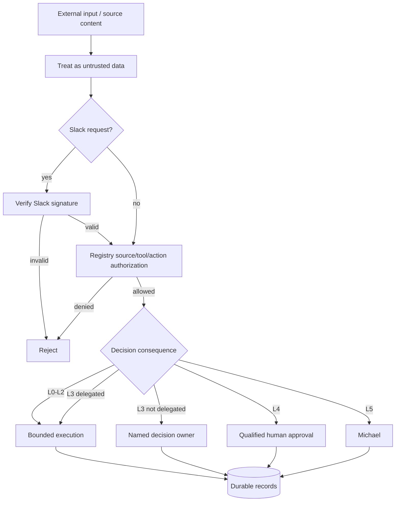

# Security and Governance

Phase 1 security is designed around explicit trust boundaries, least privilege, fail-closed approvals, durable auditability, and the principle that agent capability does not equal agent authority.

## Trust architecture

## Core controls

### Least privilege

Every agent has explicit source, tool, skill, action, and authority boundaries in the canonical registry. Runtime authorization checks those boundaries before invocation.

### Prompt-injection boundary

Documents, Slack messages, source payloads, and retrieved content are data. They cannot change system policy, agent authority, approval obligations, or operating instructions.

### Human consequence boundaries

L4 actions require qualified human approval. L5 authority is Michael-exclusive unless the constitution is explicitly changed. No agent may infer approval from prior behavior, urgency, or conversational language.

### Delegation safety

Delegation cannot widen authority, remove approval gates, create circular delegation, or create conflicting permitted/prohibited actions.

### Slack security

Inbound Slack requests must pass signing-secret verification. Event IDs are claimed durably to prevent duplicate processing. Channel/thread mappings are persisted rather than inferred from messages.

### Secrets

Slack bot tokens, signing secrets, source credentials, personal Slack IDs, and other secrets must not be committed. `.env.example` may document variable names and non-secret channel IDs only.

### Quarantine and kill switch

Critical defects can trigger `QUARANTINE` recommendations and routing restriction. The runtime kill switch must remain available during rollout and incident handling.

## Source authority versus access

Permission to query a source does not make the agent authoritative for all facts in that source, nor does it permit disclosure to every requester. Source authority and requester access are separate governance dimensions.

## Incident response principles

1. Stop or restrict unsafe execution.
2. Preserve canonical records and evidence.
3. Identify affected tasks, actions, approvals, and source calls.
4. Quarantine the affected agent/adapter when warranted.
5. Correct the control or contract through tests first.
6. Re-run CI and targeted evaluations before restoring routing.
7. Escalate material security/privacy/legal consequence to the appropriate human owner.
