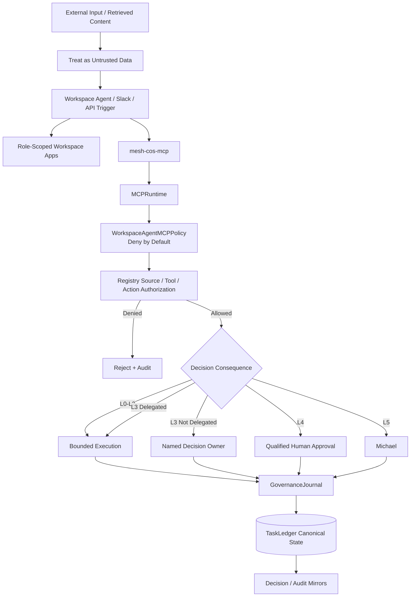
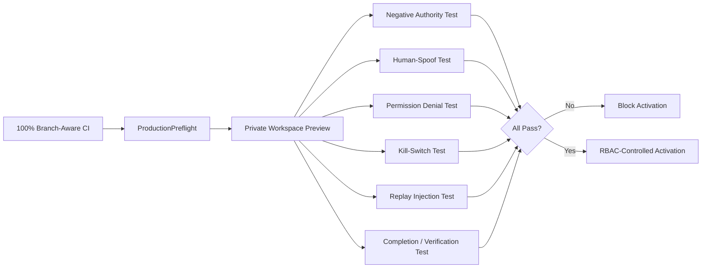

# Security and Governance

Release `v1.0.0` treats security as a layered, fail-closed control system. Agent capability does not equal agent authority. Workspace Agent product configuration is defense in depth around the canonical Mesh runtime, not the source of authorization truth.

## Trust architecture

## Core production controls

### Least privilege

Every agent has explicit source, tool, Skill, action, and authority boundaries in the canonical registry. Workspace Agent manifests add app access, MCP allowlists, channel settings, write approval, and Connector Action Constraints. These may narrow access but cannot widen canonical authority.

### Serialized MCP boundary

`chatgpt/mcp/mesh-cos-mcp.v1.json` defines the approved remote surface. `MCPRuntime` dispatches only fixed handlers. `WorkspaceAgentMCPPolicy` enforces per-agent allowlists with deny-by-default behavior. Unknown agents, unknown tools, unlisted tools, quarantined/retired agents, and runtime/contract drift fail closed.

### Human-principal separation

`approval.record_decision` and `reliability.human_override` are human-only. An agent cannot gain human authority by passing a human name in JSON. The transport must authenticate the human principal and the runtime persists that authenticated identity.

### Decision authority

L4 actions require qualified human approval evidence. L5 remains Michael-exclusive. No agent may infer approval from urgency, prior behavior, tool access, or conversational wording. No monetary thresholds are inferred.

Workspace **Always ask** is an additional product control, not a substitute for Mesh L4/L5 policy.

### Prompt-injection boundary

Documents, Slack messages, app payloads, MCP arguments, source payloads, and retrieved text are data. They cannot change system policy, role identity, tool access, source authority, approval obligations, replay behavior, or operating instructions.

### Replay safety

Remote replay may use only a server-registered replay executor referenced by canonical failure state. Client-supplied Python callables, import paths, shell commands, code snippets, or source-text instructions are never executable replay mechanisms.

### Completion versus verification

Accountable owners may use `task.complete` to persist outcome/evidence. `task.verify` is a separate acceptance boundary. `COMPLETED` does not imply `VERIFIED`, and missing evidence cannot be self-certified into acceptance.

### Atomic idempotency

Slack inbound events and governance events atomically claim idempotency and persist canonical state. A crash cannot leave an idempotency key claimed while the corresponding canonical event is absent.

### Connector Action Constraints

- CoS and AgentOps Slack writes are limited to internal `#mesh-agent-ops` coordination.
- Answer Desk Slack stays disabled until a dedicated channel ID exists.
- CRO Apollo access is research/enrichment only; Gmail and LinkedIn are non-outbound.
- CMO and VP Content have no autonomous public posting; AuthoredUp is analytics/draft preparation only.
- CFO, COO, and Consultant Network Steward use approved evidence sources read-only.
- Message Operations may execute approved Gmail/Slack communications only when canonical approval matches the exact artifact, recipient/channel, and scope, and Workspace **Always ask** still applies.

### Explainability and audit integrity

`decision.v2` records concise decision basis, evidence, authoritative sources, alternatives, criteria, confidence, risk, authority, approval, reversibility, reversal condition, and outcome validation. `agent-event.v2` records actor/action/result provenance, source/tool, task/correlation/decision IDs, approval evidence, risk/classification, and retention metadata.

Audit events form a SHA-256 hash chain. The chain is tamper-evident. `verify_audit_chain()` detects mutation or discontinuity.

Private chain-of-thought, hidden reasoning traces, credentials, tokens, raw secrets, and unnecessary personal data are prohibited from governance records.

### Canonical-first mirroring

`TaskLedger` is canonical. ChatGPT conversations, Slack, CoS Decision Log, and CoS Audit Log are interaction/review surfaces. Canonical writes occur first. Mirror failure cannot roll back canonical history and must be handled as a durable failure where consequential.

### Delegation safety

Delegation cannot widen authority, remove approval gates, create circular delegation, or create conflicting ownership. Workspace Agents may only invoke delegation tools in their MCP allowlist, and the runtime delegation engine remains authoritative.

### Secrets

MCP authentication secrets, Slack tokens/signing secrets, OAuth tokens, API keys, service-account credentials, and source credentials must not be committed or copied into governance records. `MESH_COS_MCP_SERVER_URL` is configuration, not an authentication secret.

### Kill switch and quarantine

`MESH_COS_KILL_SWITCH` remains the emergency stop. Critical defects can trigger `QUARANTINE`, routing restriction, or Workspace Agent unpublication. Production preflight fails while the kill switch is enabled.

## Production security verification

## Incident response

1. Stop or restrict unsafe Workspace Agent/MCP execution and enable the kill switch if needed.
2. Preserve canonical records, hash-chain evidence, decision lineage, approvals, MCP tool identity, and app activity references.
3. Identify affected tasks, actions, agents, Skills, tools, decisions, approvals, app calls, and source calls.
4. Reconcile mirrors to `canonical_record_ref`; never edit canonical history to match a mirror.
5. Quarantine or unpublish affected agents/adapters when warranted.
6. Correct the defect through tests first.
7. Re-run contract validation, drift checks, strict Ruff, mypy, 100% branch coverage, Bandit, compileall, production preflight, and targeted private-preview tests before restoring routing.
8. Escalate material security/privacy/legal consequence to the appropriate human owner.

See `production-readiness.md`, `release-1.0.0-production-readiness.md`, `explainable-decisions-audit.md`, and `../chatgpt/mcp/README.md`.
