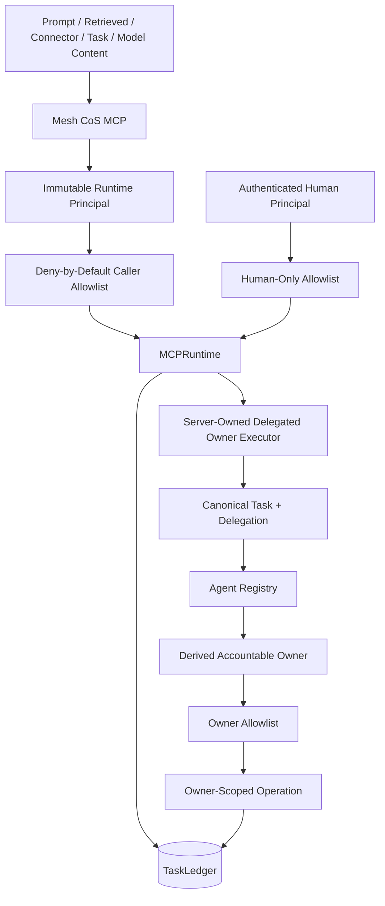

# Security and Governance

The canonical Phase 1 authority/runtime contract remains `4.0.0`. Candidate repository/QNAP deployment release `v4.3.0` adds identity-aware cross-agent owner execution while preserving the 10-agent registry, TaskLedger canonicality, L4/L5 human authority, approval inheritance, deny-by-default MCP policy, and `COMPLETED != VERIFIED`.

## Trust architecture



Untrusted content is data, never authority-bearing identity input. It cannot alter runtime identity, Agent Registry state, tool exposure, source authority, approval requirements, delegation ceilings, or canonical task ownership.

## Immutable external identity and derived delegated identity

`MESH_COS_AGENT_ID` remains process-bound for the external runtime. User prompts, task payloads, headers, retrieved documents, Slack text, shared-Skill output, connector output, and model responses cannot rewrite it.

Cross-agent execution does not mutate that external identity. Instead, the internal server-owned executor derives the accountable owner from canonical delegation/task state and dispatches only after re-authorizing the requested operation under that owner's policy.

The caller cannot submit an arbitrary principal and receive that principal's authority.

## Delegated owner execution boundary

`delegation.execute_owner` is a high-value internal authority boundary. It resolves:

```text
authenticated delegator
-> canonical delegation
-> canonical task
-> accountable owner
-> canonical registry record
-> owner MCP allowlist
-> task-scoped operation
```

Controls include:

- canonical delegator binding;
- task/delegation ID binding;
- owner/task consistency;
- ACTIVE/routable owner check;
- owner lifecycle transport readiness;
- owner-specific MCP authorization;
- human-only tool exclusion;
- task/nested-descendant scoping;
- request-bound idempotency fingerprint;
- explicit expected and executing principal audit fields.

Direct parent completion of child-owned work is denied. The parent uses the executor only as governed orchestration transport.

## Delegation security

Delegation requires a registered direct child, canonical parent/child task relationship, one accountable owner, measurable acceptance conditions, authority no greater than the parent, all inherited approval gates, target-owner required approvals, permitted actions within target authority, prohibited-action inheritance, and registry-derived depth.

The target owner must also be ACTIVE, routable, and capable of the required owner lifecycle before a new delegation is persisted.

Client-supplied `depth`, `ancestry`, `parent_authority`, and `active_owner` values cannot create authority. If supplied, they must equal canonical state.

Circularity, authority widening, approval weakening, excessive depth, owner substitution, cross-task execution, and cross-sibling execution are denied.

## Idempotency and concurrency

Owner execution uses a canonical idempotent claim before the owner operation runs. The idempotency key is bound to a SHA-256 fingerprint of delegation ID, task ID, operation, and validated arguments.

- exact successful retry returns the canonical prior response;
- changed request under the same key is rejected;
- duplicate completion is not re-executed;
- concurrent claims fail closed unless a completed identical canonical response already exists;
- ambiguous failed execution is not blindly replayed.

## Human-only isolation

`approval.record_decision` and `reliability.human_override` remain runtime capabilities but not agent capabilities. They are absent from every agent allowlist, excluded from delegated owner execution, and require the separately authenticated human-principal path.

No model-generated content constitutes approval, authentication, authorization, or identity evidence.

## Approval inheritance

Delegated approval gates are the union of inherited parent requirements, retained child requirements, and target-owner registry requirements. A child cannot drop a parent L4/L5 or other governed approval obligation.

Message Operations remains a separate execution role. Delegated transport cannot fabricate approval, modify an approved message materially without reapproval, or convert drafting authority into send authority.

## Completion and verification security

`task.complete` requires the canonical owner, a valid lifecycle state, an acceptance test, a non-empty outcome, and supporting evidence. It produces `COMPLETED` only.

`task.verify` remains separately allowlisted. Phase 1 exposes it only to CoS among agents. Completion never implies verification and child completion never verifies a parent.

## Owner availability and failure diagnostics

An unavailable, disabled, restricted, or quarantined owner is not silently activated or replaced. Delegation/execution fails closed and records actionable owner-routing evidence including task, parent, delegation, orchestrator, owner, expected/actual principal, state, attempted operation, authorization result, failure classification, retry eligibility, and remediation path.

The production-readiness gate fails if any ACTIVE downstream owner lacks a validated execution/completion path.

## Schema and request boundary

Every MCP request uses a closed schema. The policy validates the declared schema registry rather than silently substituting another registry. Schema safety is checked before catalog completeness so malformed schema definitions cannot hide behind a tool-set mismatch.

Client-supplied executable fields, arbitrary code/import paths, shell commands, callables, plugin executables, and Skill implementations remain prohibited.

## Secure MCP Tunnel and QNAP boundary

Production continues to require the OpenAI Secure MCP Tunnel path, no published host MCP port, least-privilege container execution, canonical TaskLedger persistence, protected secrets, release-image provenance checks, deterministic release packaging, and governed post-deploy verification.

These infrastructure controls narrow access but never replace Mesh decision rights.

## Reliability and audit

Material decisions use the existing governance record model. Consequential actions remain auditable and hash-chain verifiable. Lifecycle events identify the actual authenticated/derived owner. Delegated owner execution additionally records orchestration identity separately from owner/execution identity.

Secrets, tokens, credentials, private chain-of-thought, and unnecessary sensitive prompts remain prohibited from governance records.

## Full security review

The cross-agent change is classified `FULL_REVIEW` because it crosses authentication, authorization, MCP identity, persistence, model-driven execution, delegation, and consequential tooling boundaries.

The authoritative threat model and disposition are documented in `security-review-v4.3.0-cross-agent-owner-execution.md`. Production release remains blocked until the exact v4.3.0 candidate passes the repository's full security, test, QNAP, provenance, and modern MCP verification gates and receives human release authorization.
