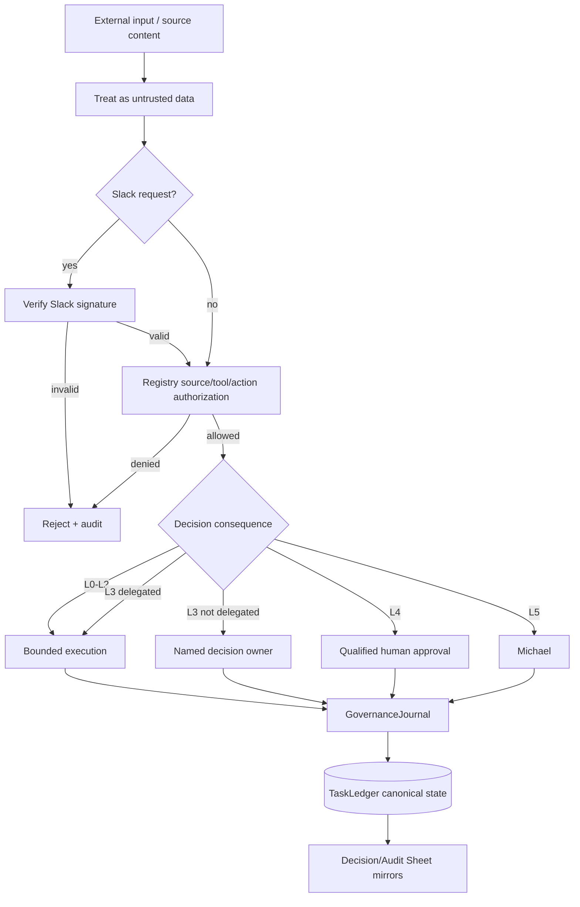

# Security and Governance

Phase 1 security is designed around explicit trust boundaries, least privilege, fail-closed approvals, durable auditability, and the principle that agent capability does not equal agent authority.

## Trust architecture

## Core controls

### Least privilege

Every agent has explicit source, tool, skill, action, and authority boundaries in the canonical registry. Runtime authorization checks those boundaries before invocation.

### Prompt-injection boundary

Documents, Slack messages, source payloads, and retrieved content are data. They cannot change system policy, agent authority, approval obligations, or operating instructions.

### Human consequence boundaries

L4 actions require qualified human approval. L5 authority is Michael-exclusive unless the constitution is explicitly changed. No agent may infer approval from prior behavior, urgency, or conversational language. Approval-required decisions must carry an approval reference and named approver in the explainable decision record.

### Explainability boundary

Explainability means recording concise, reviewable facts about a decision: decision basis, evidence references, authoritative sources, alternatives, selection criteria, confidence, risk, authority, approval, reversibility, reversal conditions, and outcome validation. It does **not** mean storing private chain-of-thought, hidden reasoning traces, raw prompts containing sensitive context, or unnecessary personal data.

### Audit integrity

`mesh.cos.agent-event.v2` records actor, action, authority, source/tool, task/correlation/decision IDs, summaries, result, evidence, approval, model/skill provenance, risk/classification, and retention metadata. Audit events form a SHA-256 hash chain. The chain is tamper-evident, not tamper-proof, and `verify_audit_chain()` detects mutation or discontinuity.

### Canonical-first mirroring

`TaskLedger` is canonical. The CoS Decision Log and CoS Audit Log Google Sheets are human-readable operational mirrors. Canonical writes occur first. A Sheet write failure cannot roll back canonical governance state and must be recorded as a durable mirror failure for remediation.

### Delegation safety

Delegation cannot widen authority, remove approval gates, create circular delegation, or create conflicting permitted/prohibited actions.

### Slack security

Inbound Slack requests must pass signing-secret verification. Event IDs are claimed durably to prevent duplicate processing. Channel/thread mappings are persisted rather than inferred from messages.

### Secrets and sensitive data

Slack bot tokens, signing secrets, OAuth tokens, source credentials, API keys, personal Slack IDs, and other secrets must not be committed or copied into governance logs. Governance records should reference protected evidence rather than duplicating sensitive source content when a pointer is sufficient.

### Quarantine and kill switch

Critical defects can trigger `QUARANTINE` recommendations and routing restriction. The runtime kill switch must remain available during rollout and incident handling.

## Cross-agent governance policy

`config/governance-policy.v1.json` applies to every registered agent at runtime. Audit logging is required for consequential agent/skill actions. `decision.v2` logging is required when an agent decides or makes a material recommendation. The shared policy adds the `governance-journal` capability without expanding an agent's functional authority.

## Source authority versus access

Permission to query a source does not make the agent authoritative for all facts in that source, nor does it permit disclosure to every requester. Source authority and requester access are separate governance dimensions.

## Incident response principles

1. Stop or restrict unsafe execution.
2. Preserve canonical records, hash-chain evidence, decision lineage, and approvals.
3. Identify affected tasks, actions, agents, tools, decisions, approvals, and source calls.
4. Reconcile the human-readable Sheets to `canonical_record_ref` when the incident touches mirror delivery.
5. Quarantine the affected agent/adapter when warranted.
6. Correct the control or contract through tests first.
7. Re-run CI and targeted evaluations before restoring routing.
8. Escalate material security/privacy/legal consequence to the appropriate human owner.

See `explainable-decisions-audit.md` for the detailed schemas, mirror configuration, privacy boundary, and reconciliation model.
