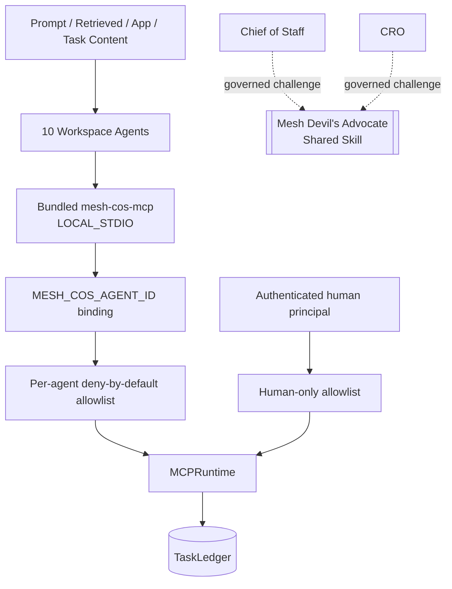

# Security and Governance

Release `v4.0.0` treats the bundled ChatGPT MCP, agent identity binding, human-principal path, delegation engine, and shared Skill boundary as fail-closed controls around the canonical Mesh runtime.

## Trust architecture

Untrusted content is data, not operating policy. It cannot alter identity, tool exposure, approval requirements, source authority, delegation ceilings, or canonical state.

## Human-only isolation

`approval.record_decision` and `reliability.human_override` are runtime capabilities but not agent capabilities. They are absent from every agent allowlist, excluded from the stdio tool catalog, and rejected by `call_agent`. A non-empty authenticated human principal is required for `call_human`.

Regression tests prove denial for CoS and every other agent and positive execution through the human path.

## Immutable agent identity

`MESH_COS_AGENT_ID` is process-bound. User prompts, retrieved documents, task payloads, delegated instructions, shared-Skill output, and connector data cannot impersonate a human principal or another agent. Runtime governance records derive actor identity, role, version, and authority from the canonical registry rather than client-supplied identity fields.

## Delegation security

Delegation requires a registered direct child, valid depth, one accountable owner, measurable acceptance conditions, authority no greater than the parent, and all inherited approval gates. Circularity, authority widening, approval weakening, and excessive depth are denied before persistence.

## Completion and verification security

`task.complete` requires owner-or-CoS write access plus a valid lifecycle state, non-empty outcome, and supporting evidence. It cannot result in `VERIFIED`.

`task.verify` is separately allowlisted. Phase 1 exposes it only to CoS. Passing verification requires acceptance evidence and a completed task. Other owners cannot self-verify.

## Shared Devil's Advocate boundary

Mesh Devil's Advocate is `ADVISORY_ONLY`. It cannot modify canonical facts, execute external actions, own tasks, record approvals, become an MCP principal, or widen caller authority. Its output may be retained as evidence or provenance only.

## Message Operations boundary

Message Operations is the tenth registered agent. It can inspect approval state and invoke its governed execution capability within its role boundary, but cannot record its own approval or materially modify approved content without reapproval. Consequential outbound execution remains human-gated.

## Reliability and audit

Replay is restricted to server-registered executors referenced by canonical failure state. Client-supplied callables, import paths, source code, or shell commands are never executed as replay logic.

Material decisions use `decision.v2`; consequential actions use `agent-event.v2`. Governance audit events are tamper-evident and hash-chain verification is a release certification requirement. Secrets, credentials, tokens, private chain-of-thought, and unnecessary sensitive prompts are prohibited from governance records.

## Defense in depth

Workspace `Always ask`, connector restrictions, source permissions, private-preview publication state, and target-environment RBAC narrow behavior but never replace Mesh L4/L5 authority controls.