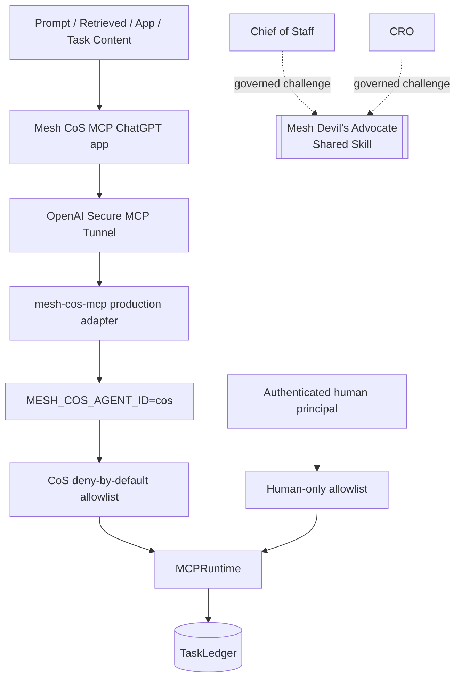

# Security and Governance

The canonical Phase 1 authority/runtime contract remains `4.0.0`. Repository/QNAP deployment release `v4.1.7` applies that unchanged authority model to the published **Mesh CoS MCP** ChatGPT app and OpenAI Secure MCP Tunnel production path while adding serving-release observability, release-image provenance, and governed response-envelope verification.

## Trust architecture



Local engineering/certification retains the bundled `LOCAL_STDIO` path to the same canonical runtime. Untrusted content is data, not operating policy. It cannot alter identity, tool exposure, approval requirements, source authority, delegation ceilings, or canonical state.

## Secure MCP Tunnel ingress

Production requires `MCP_AUTH_MODE=tunnel` and a configured `MCP_TRUSTED_CLIENT_IP`. `/mcp` dispatch occurs only after the request source address matches the private tunnel-sidecar identity. The production Compose model publishes no host MCP port, and the remote adapter does not introduce an independent OAuth flow.

`/healthz` and `/readyz` intentionally expose only non-secret runtime identity metadata. They do not confer MCP authority.

## Dual release identity

Production tool envelopes and status endpoints distinguish the immutable authority/runtime contract from the deployment release:

```text
mcp_version: 4.0.0
deployment_release: 4.1.7
agent_id: cos
transport: SECURE_MCP_TUNNEL
```

`MESH_COS_DEPLOYMENT_RELEASE` is non-secret release metadata. The remote runtime requires it before listening, but it is never used to select agent identity, tools, approval rights, delegation rights, or canonical state.

## Release-image provenance boundary

The mutable local Docker tag is not trusted as release authority. QNAP preparation reads the extracted bundle `version=` and `commit=` values as data and compares them with the local image OCI `org.opencontainers.image.version` and `org.opencontainers.image.revision` labels.

An existing image is reusable only when both labels match the extracted release identity. A mismatch forces a rebuild from the extracted build context. After build or reuse, the same labels are revalidated before the image ID is recorded and Compose replacement can proceed.

Release metadata is never sourced or evaluated as shell code and cannot expand Docker, MCP, human, or agent authority.

## Governed response-envelope verification boundary

v4.1.7 post-deploy verification executes one hardcoded read-only `registry.get_agent` MCP `tools/call` against the running application from a short-lived verifier that shares the tunnel client's network namespace.

The verifier is deliberately constrained:

- non-root UID/GID 65532;
- read-only root filesystem;
- all capabilities dropped;
- no Docker socket;
- no TaskLedger/state mount;
- no tunnel secret mount or secret environment value;
- no persistent service lifetime;
- only the expected deployment release is passed as non-secret verification data.

The verifier does not change `MCP_TRUSTED_CLIENT_IP` or create a new long-running trusted client. It uses authority the QNAP Docker administrator already holds solely to verify the actual governed response boundary and exits immediately.

## Human-only isolation

`approval.record_decision` and `reliability.human_override` are runtime capabilities but not agent capabilities. They are absent from every agent allowlist, excluded from agent tool catalogs, and rejected by `call_agent`. A non-empty authenticated human principal is required for `call_human`.

Regression tests prove denial for CoS and every other agent and positive execution through the human path.

## Immutable agent identity

`MESH_COS_AGENT_ID` is process-bound. User prompts, retrieved documents, task payloads, HTTP headers, delegated instructions, shared-Skill output, and connector data cannot impersonate a human principal or another agent. Runtime governance records derive actor identity, role, version, and authority from the canonical registry rather than client-supplied identity fields.

## Delegation security

Delegation requires a registered direct child, valid depth, one accountable owner, measurable acceptance conditions, authority no greater than the parent, and all inherited approval gates. Circularity, authority widening, approval weakening, and excessive depth are denied before persistence.

## Completion and verification security

`task.complete` requires owner-or-CoS write access plus a valid lifecycle state, non-empty outcome, and supporting evidence. It cannot result in `VERIFIED`.

`task.verify` is separately allowlisted. Phase 1 exposes it only to CoS. Passing verification requires acceptance evidence and a completed task. Other owners cannot self-verify.

## Shared Devil's Advocate boundary

Mesh Devil's Advocate is `ADVISORY_ONLY`. It cannot modify canonical facts, execute external actions, own tasks, record approvals, become an MCP principal, or widen caller authority. Its output may be retained as evidence or provenance only.

## Message Operations boundary

Message Operations is the tenth registered agent. It can inspect approval state and invoke its governed execution capability within its role boundary, but cannot record its own approval or materially modify approved content without reapproval. Consequential outbound execution remains human-gated.

## QNAP container boundary

The production application runtime remains UID/GID 65532 with read-only root filesystem, all Linux capabilities dropped, no-new-privileges, no Docker socket, explicit CPU/memory controls, and the canonical TaskLedger bind-mounted as the single writable state boundary. The tunnel runtime secret remains file-only and is excluded from `.env`, release assets, backups, diagnostics, tool responses, and the ephemeral verifier.

## Reliability and audit

Replay is restricted to server-registered executors referenced by canonical failure state. Client-supplied callables, import paths, source code, or shell commands are never executed as replay logic.

Material decisions use `decision.v2`; consequential actions use `agent-event.v2`. Governance audit events are tamper-evident and hash-chain verification is a release certification requirement. Secrets, credentials, tokens, private chain-of-thought, and unnecessary sensitive prompts are prohibited from governance records.

## Defense in depth

Workspace `Always ask`, connector restrictions, source permissions, Secure MCP Tunnel private ingress, release-image provenance, governed response-envelope verification, least-privilege QNAP runtime controls, and target-environment RBAC narrow behavior but never replace Mesh L4/L5 authority controls.

The v4.1.7 targeted security receipt is `qnap-security-review-v4.1.7.md`.
