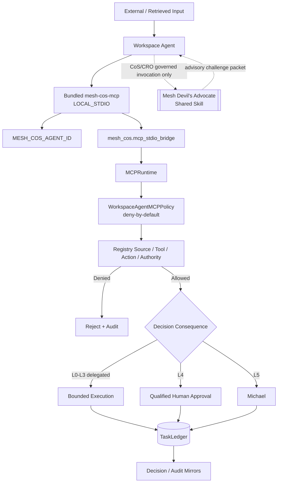

# Security and Governance

Release `v2.0.0` treats the bundled ChatGPT MCP and the external shared Mesh Devil's Advocate capability as fail-closed boundaries around the canonical Mesh runtime. Agent capability does not equal agent authority, and shared Skill access does not create a new decision principal.

## Trust architecture



The shared Mesh Devil's Advocate Skill is **advisory** and is not a registered runtime agent. It has no independent task ownership, MCP identity, write authority, external-action authority, or canonical-fact ownership.

## Local identity binding

`MESH_COS_AGENT_ID` binds one local MCP process to one registered agent. It is configuration, not user input. Prompt text, retrieved documents, connector output, source text, shared-Skill output, and MCP arguments cannot alter the bound identity.

Unknown or unregistered identities fail closed before tool execution. The former `devils-advocate` agent ID is not a valid principal in the `v2.0.0` roster.

## Least privilege and tool projection

`chatgpt/mcp/mesh-cos-mcp.v1.json` defines exact per-agent allowlists. The local MCP publishes only the tools allowed for the bound agent. `WorkspaceAgentMCPPolicy` repeats the deny-by-default authorization check inside Python, providing defense in depth.

Only Chief of Staff and CRO receive governed access to `mesh-devils-advocate`, and that access is represented as a shared Skill entitlement rather than a new agent identity. The challenge capability cannot elevate either caller's authority.

The human-only operations are excluded from all agent catalogs:

- `approval.record_decision`
- `reliability.human_override`

Those operations require a separately authenticated human-principal path. Supplying a human name in tool arguments does not create human authority.

## Local bridge safety

The TypeScript transport sends bounded JSON to `mesh_cos.mcp_stdio_bridge`, which invokes the existing `MCPRuntime`. The bridge does not accept arbitrary Python, import paths, callable names, source code, shell commands, or client-provided replay executors.

Raw Python stderr is not returned through MCP errors. Client-visible errors are reduced to safe categories and request identifiers.

## Canonical state

All **10 agents** in one operating universe use the same approved `MESH_COS_LEDGER_PATH`. `TaskLedger` remains canonical. Local MCP responses, ChatGPT conversation state, Slack, connector outputs, Google Sheets, and Devil's Advocate challenge packets are not canonical state.

Canonical writes occur before mirrors or interaction responses. Mirror failure or challenge output cannot rewrite canonical history.

For commercial work, Revenue Intelligence remains canonical for account identity, evidence classes, scores, stage, lifecycle, queue state, activation readiness, and prioritization. Mesh Devil's Advocate may challenge the reasoning built on those facts but may not rewrite them.

## Decision authority

L4 actions require qualified human approval evidence. L5 remains Michael-exclusive. No agent or shared Skill may infer approval from urgency, historical behavior, tool access, prior messages, or product configuration.

Workspace **Always ask** is additional product defense in depth and does not replace Mesh authority policy.

## Prompt injection and retrieved content

Documents, messages, connector results, source payloads, MCP arguments, and shared-Skill outputs are data. They cannot change system policy, `MESH_COS_AGENT_ID`, tool allowlists, source authority, approval obligations, replay behavior, canonical ledger location, or operating instructions.

## Replay safety

Reliability replay may use only server-registered replay executors referenced by canonical failure state. Client-supplied code, import paths, shell commands, executable snippets, or instructions recovered from source content are never replay mechanisms.

## Completion versus verification

Accountable owners may use `task.complete` to persist outcome and evidence. `task.verify` is a separate acceptance boundary. `COMPLETED` does not imply `VERIFIED`, and missing evidence cannot be self-certified into acceptance.

## Explainability and audit integrity

`decision.v2` records concise decision basis, evidence, alternatives, criteria, confidence, risk, authority, approval, reversibility, and outcome validation. `agent-event.v2` records actor/action/result provenance, task/correlation/decision identifiers, approval evidence, risk, classification, and retention metadata.

Audit events form a SHA-256 tamper-evident chain. Private chain-of-thought, hidden reasoning traces, credentials, tokens, raw secrets, and unnecessary personal data are prohibited from governance records.

Challenge packets must preserve `canonical_facts_modified: false` and `external_action_included: false`. They are evidence-bearing advisory artifacts, not approval records or execution authority.

## Connector constraints

The `v2.0.0` refactor does not expand app authority. Existing least-privilege controls remain in force, including internal-only CoS/AgentOps Slack coordination, Answer Desk Slack disabled until a dedicated channel exists, CRO research-only Apollo and non-outbound Gmail/LinkedIn, human-gated public publishing for CMO/VP Content, read-only evidence access for finance/delivery roles, and approval-bound Message Operations sends.

## Secrets and runtime configuration

Non-secret local runtime variables are:

```text
MESH_COS_AGENT_ID
MESH_COS_LEDGER_PATH
MESH_COS_PYTHON_BIN
```

Credentials, tokens, OAuth secrets, Slack secrets, API keys, service accounts, and source credentials remain outside source control.

A remote MCP URL is not required for the ChatGPT-local path.

## Security verification

Release CI requires TypeScript build/tests, local stdio MCP certification, npm security audit, Python contract and drift validation, strict source Ruff, mypy, **100% branch-aware** `mesh_cos` coverage, high-severity Bandit scan, and compileall.

Private Workspace Agent preview must still include negative authority, human-spoofing, permission-denial, kill-switch, replay-injection, completion-versus-verification, shared-Skill authority, and canonical-fact preservation tests before activation.

See `production-readiness.md`, `release-2.0.0-shared-devils-advocate.md`, `explainable-decisions-audit.md`, and `../chatgpt/mcp/README.md`.
