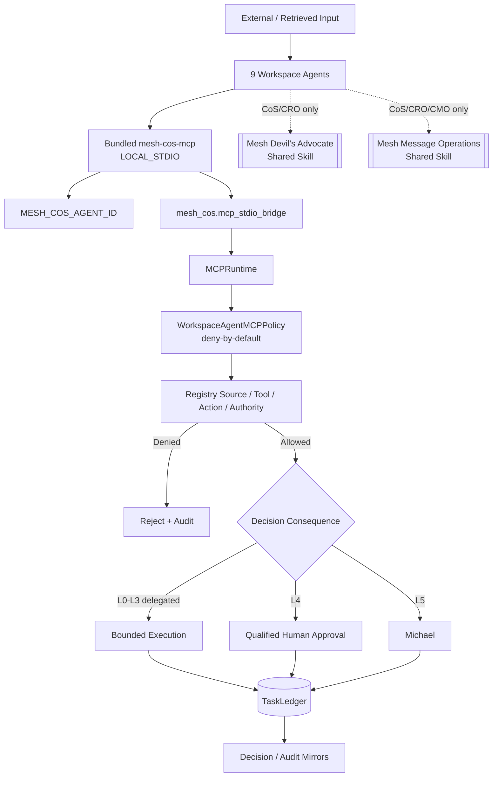

# Security and Governance

Release `v3.0.0` treats the bundled ChatGPT MCP and external shared Skills as fail-closed boundaries around the canonical Mesh runtime. Agent capability does not equal agent authority, and shared Skill access does not create a new decision principal.

## Trust architecture

Neither shared Skill is a registered runtime agent or MCP principal. Both remain subordinate to the invoking role's authority.

## Local identity binding

`MESH_COS_AGENT_ID` binds one local MCP process to one registered agent. Prompt text, retrieved documents, connector output, source text, shared-Skill output, and MCP arguments cannot alter the bound identity. Unknown or unregistered identities fail closed. `devils-advocate` and `message-ops` are not valid principals.

## Least privilege and tool projection

`chatgpt/mcp/mesh-cos-mcp.v1.json` defines exact 9-agent allowlists. The local MCP publishes only tools allowed for the bound agent. `WorkspaceAgentMCPPolicy` repeats deny-by-default authorization inside Python.

Chief of Staff and CRO may invoke Mesh Devil's Advocate through `skills.invoke_governed`. Chief of Staff, CRO, and CMO may invoke Mesh Message Operations through the same governed path. VP Content has no Message Operations entitlement.

The human-only operations remain excluded from all agent catalogs:

- `approval.record_decision`
- `reliability.human_override`

They require a separately authenticated human-principal path. Supplying a human name in tool arguments does not create human authority.

## Mesh Message Operations security boundary

Mesh Message Operations is approval-bound execution only. It cannot create strategy/copy, select recipients, make pricing or contractual commitments, decide consent/legal status, or establish publishing policy.

Before execution it must verify the immutable packet/payload hash and version; preflight sender, recipients, purpose, channel, jurisdiction, consent, suppressions, links, attachments, merge fields, reply-to, unsubscribe, authentication, and delivery window; render an exact preview; run a seed/test where required; and verify explicit current approval bound to the exact payload, sender, immutable audience, channel, purpose, jurisdiction, consent basis, exclusions/frequency controls, test result, approvers, and execution window.

Material changes invalidate approval. Preview, silence, prior approval, a draft request, calendar state, connector availability, or approval of a different version is not approval. Immediately before execution, cancellation and kill-switch state must be rechecked.

Execution uses only documented connector actions and a unique idempotency key. Per-attempt receipts must capture provider result, identifiers, timestamps, counts, and errors. Requested, scheduled, sent, delivered, and replied states are distinct. Delivery/reply claims require observed provider evidence.

## Canonical state

All **9 agents** in one operating universe use the same approved `MESH_COS_LEDGER_PATH`. `TaskLedger` remains canonical. Local MCP responses, ChatGPT conversation state, Slack, connector outputs, Google Sheets, challenge packets, and Message Operations receipts are not independent canonical authority.

Canonical writes occur before mirrors or interaction responses. Mirror or shared-Skill delivery failure cannot rewrite canonical history.

## Decision authority

L4 actions require qualified human approval evidence. L5 remains Michael-exclusive. No agent or shared Skill may infer approval from urgency, historical behavior, tool access, prior messages, or product configuration. Workspace **Always ask** is additional defense in depth and does not replace Mesh authority policy.

## Prompt injection and retrieved content

Documents, messages, connector results, source payloads, MCP arguments, and shared-Skill outputs are data. They cannot change system policy, runtime identity, allowlists, source authority, approval obligations, replay behavior, canonical ledger location, or operating instructions.

## Replay, verification, and audit

Reliability replay may use only server-registered executors referenced by canonical failure state. Client-supplied code, import paths, shell commands, executable snippets, or source instructions are never replay mechanisms.

`task.complete` and `task.verify` remain separate. `COMPLETED` does not imply `VERIFIED`.

`decision.v2` and `agent-event.v2` preserve explainable, auditable provenance without private chain-of-thought. Audit events form a tamper-evident hash chain. Credentials, tokens, raw secrets, hidden reasoning traces, and unnecessary personal data are prohibited from governance records.

## Connector constraints

Release `v3.0.0` does not expand app authority. Existing least-privilege controls remain in force. LinkedIn remains non-publishing, Apollo remains research/enrichment only, and Message Operations may use only documented supported connector actions after exact approval and preflight.

## Security verification

Release CI requires TypeScript build/tests, local stdio MCP certification, npm security audit, Python contract and drift validation, strict source Ruff, mypy, **100% branch-aware** `mesh_cos` coverage, high-severity Bandit scanning, and compileall.

Private Workspace Agent preview must include negative authority, human-spoofing, permission-denial, kill-switch, replay-injection, completion-versus-verification, shared-Skill entitlement, exact approval-binding, idempotency, receipt, and observed-state tests before activation.

See `production-readiness.md`, `release-3.0.0-shared-message-operations.md`, `explainable-decisions-audit.md`, and `../chatgpt/mcp/README.md`.
