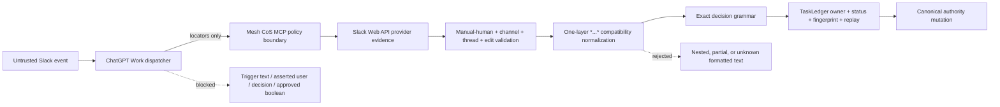

# Mesh CoS MCP v4.2.1 Security Review

Status: **FULL REVIEW CANDIDATE**

Release: `4.2.1`
Canonical MCP runtime contract: `4.0.0`
Scope: ChatGPT-native Slack event-triggered HITL, provider-retrieved decision parsing, TaskLedger authority mutation, QNAP runtime, Secure MCP Tunnel.

## Security decision

v4.2.1 is a security-sensitive patch because it changes parsing immediately before a consequential human approval decision can be recorded. The accepted change is intentionally narrow: one observed Slack whole-message bold wrapper is normalized, after which the existing exact decision grammar and every provider/state authorization control remain mandatory.

The ChatGPT Work trigger remains explicitly non-authoritative. Canonical authority can still be created only after QNAP independently retrieves the provider message, verifies its metadata, validates the exact pending approval and immutable fingerprint, and passes replay controls.

## Trust-boundary diagram

The Mermaid source above was validated through Mermaid Chart before release preparation.

## Threat model and controls

| Threat | v4.2.1 control | Result |
| --- | --- | --- |
| Trigger payload contains approval text | Governed adapter rejects authority-bearing trigger fields; dispatcher passes only locators | Fail closed |
| Slack provider returns `*APPROVE*` | Remove exactly one whole-message `*...*` wrapper, then apply the existing exact grammar | Accepted only as exact APPROVE |
| Nested formatting `**APPROVE**` | One layer would leave `*APPROVE*`, which does not match the exact grammar | Rejected |
| Partial formatted approval `*APPROVE* extra` | Whole-message wrapper pattern does not match | Rejected |
| Formatted non-decision `*looks good*` | Wrapper may normalize, but decision grammar does not match | Rejected |
| Another Slack user replies | Provider user must equal the protected approver identity mapped to `michael` | Rejected |
| Bot/app reply | `app_id`, `bot_id`, `bot_profile`, or subtype evidence is rejected | Rejected |
| Edited reply | Provider `edited` metadata is rejected | Rejected |
| Deleted/unavailable reply | Exact provider lookup must return one matching message | Rejected |
| Wrong/root/unbound thread | Provider locator and canonical thread binding checks remain mandatory | Rejected |
| Payload changed after notice | Canonical payload fingerprint must equal bound fingerprint | Rejected |
| Duplicate Work delivery | Provider event key remains deterministic and reconciliation remains idempotent | No second decision |
| Different second provider message attempts reversal | Existing decision replay guard prevents a different interaction from re-deciding approval | Rejected |
| Slack API failure | No provider evidence means no authority mutation | Fail closed |
| Socket Mode regression | Runtime still forbids xapp credential and does not start a WebSocket listener | Rejected by release gates |
| Parser normalization expands beyond incident shape | Unit and BDD cases require nested, partial, and non-decision formatting to remain rejected | Regression blocker |

## Least privilege and secrets

No credential expansion is required for v4.2.1. The Slack manifest remains limited to:

- `chat:write`
- `groups:history`

The protected `xoxb-` credential remains read-only in the runtime and the approver Slack identity remains in its protected file. No `xapp-` Socket Mode secret is required or accepted.

Slack's current developer documentation lists `groups:history` as compatible with `conversations.replies` for bot and user tokens and states that adding new OAuth scopes to an already installed app requires reauthorization. v4.2.1 does not change the scope set from the existing v4.2.0/v4.1.17 manifest, so no new Slack OAuth permission is introduced by this patch.

## Prompt-injection and untrusted-content handling

The Work dispatcher does not parse or forward Slack message text. The provider text is retrieved only inside the trusted MCP policy boundary. Even there, the text is not treated as instructions. It is evaluated against a fixed, minimal decision grammar. CHANGE follow-up text remains untrusted change requirements and requires a new approval cycle before consequential execution.

## Residual risks

1. **Slack rendering drift.** Slack may represent future formatting differently. Mitigation: do not add generic Markdown normalization; production acceptance and explicit regression cases are required for any new representation.
2. **ChatGPT event-trigger platform drift.** Trigger metadata/filtering can change. Mitigation: trigger remains locator-only and server controls are authoritative.
3. **Slack provider availability.** Provider outages delay approval. Mitigation: fail closed and replay the same locator after service restoration.
4. **Bot credential compromise.** The credential can read/post within its granted channel scope. Mitigation: protected storage, narrow scopes, protected human identity, canonical binding/fingerprint checks, and rotation procedure.
5. **Historical Socket Mode compatibility code.** The hardened decision engine still reuses compatibility classes internally. Mitigation: runtime gates continue to prove no WebSocket listener or xapp secret is active.

## Required verification

- New parser regression tests cover provider `*APPROVE*`, `*DENY*`, `*CHANGE*`, and rejection of nested/partial/non-decision variants.
- Native-trigger test reproduces the production provider text shape `*APPROVE*` and reaches APPROVED / READY_FOR_ACTION.
- 100% Python coverage remains intact.
- Ruff, mypy, Bandit, compileall, contract drift, and ChatGPT package gates pass.
- Node build/test/security gates pass.
- QNAP POSIX deployment and runtime checks pass.
- v4.2.1 bundle/checksum and container provenance pass.
- no xapp/Socket Mode production regression is introduced.
- live production acceptance replays the incident and completes the full positive/negative matrix.

No production-ready claim is valid until repository verification and external live acceptance both pass.
