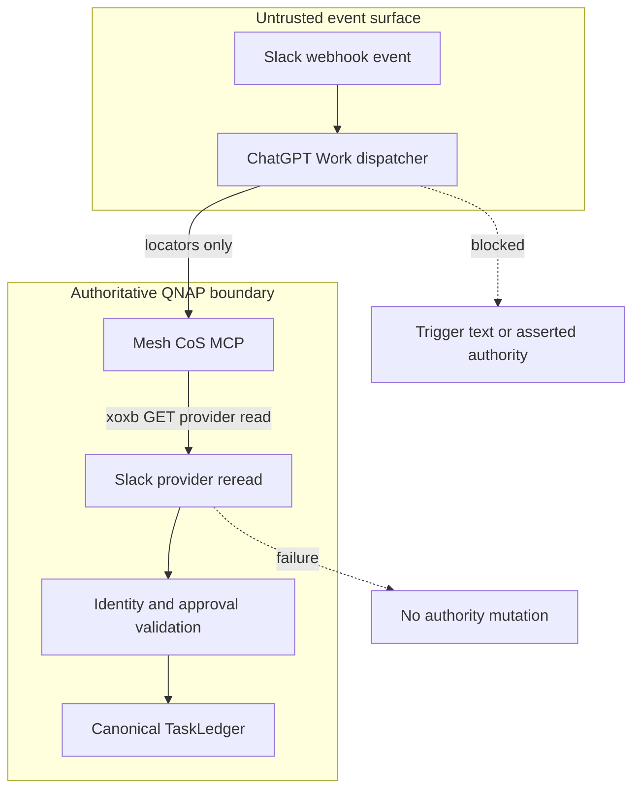

# Mesh CoS MCP v4.2.2 Security Review

Status: **TARGETED REVIEW CANDIDATE**

Release: `4.2.2`
Canonical MCP runtime contract: `4.0.0`
Scope: Slack OAuth bot credential, external Slack Web API transport, provider-retrieved human decision evidence, ChatGPT-native dispatcher boundary, TaskLedger authority mutation, QNAP deployment verification.

## Security decision

v4.2.2 is security-sensitive because it changes an external API transport immediately upstream of the human-approval authority boundary and adds a live deployment check using the protected Slack bot credential.

The accepted authority model does not change. ChatGPT Work remains an untrusted wake-up/locator surface. QNAP must independently retrieve Slack provider evidence before any canonical approval mutation. Provider errors, network failures, identity mismatches, stale state, malformed decisions, or replay conflicts remain fail closed.

## Trust boundary

This Mermaid source was validated with Mermaid Chart during release preparation.

## Falsifiable security properties

1. The Work dispatcher cannot create authority by supplying text, identity, approval state, decision, principal, or consequential instructions.
2. `conversations.replies` sends only provider locators as query parameters and keeps the OAuth token in the Authorization header.
3. Slack write operations remain segregated on POST/JSON and are not accidentally converted to read semantics.
4. A Slack API error never mutates approval state and may expose only a sanitized provider error code.
5. Provider response metadata, full response bodies, authorization headers, and OAuth tokens are never included in runtime diagnostics.
6. The installed bot must demonstrate real read access to the governed private channel before deployment verification passes.
7. The expected production Slack application identity is `A0B49RNE4K0`; the prior incorrect value must fail readiness.
8. The bot credential remains `xoxb-`, protected, read-only mounted, and limited to the existing bot scope set required by the architecture.
9. No `xapp-` credential, WebSocket listener, Socket Mode ingress, polling loop, or alternate approval path is introduced.
10. Exact provider message, configured human user, manual authorship, thread binding, edit state, PENDING state, owner, fingerprint, and replay checks remain mandatory.

## Threat and control matrix

| Threat | v4.2.2 control | Expected result |
| --- | --- | --- |
| Trigger contains `APPROVE` or asserted identity | Dispatcher and governed adapter pass only message locators | No authority from trigger |
| Slack read method receives parameters in an unsupported body | Read methods use GET/query and regression tests inspect method, URL and body | Prevented |
| OAuth token leaks in URL | Token remains Authorization header only; test asserts token absent from URL | Prevented |
| Slack returns `missing_scope` or `invalid_arguments` | Runtime emits only sanitized code and raises | Fail closed |
| Slack response metadata contains sensitive detail | Metadata is not included in exception text | Not exposed |
| Bot lacks `groups:history` | QNAP verify calls `conversations.history` against governed private channel | Deployment verification fails |
| Installed OAuth grant is stale | Same live provider-read gate exercises actual mounted token | Deployment verification fails |
| Bot is not a member / cannot access channel | Provider-read gate fails | Deployment verification fails |
| Wrong Slack application ID | Runtime and preflight expect provider-verified `A0B49RNE4K0` | Readiness fails |
| Another Slack user replies | Provider user must equal protected approver identity | Rejected |
| Bot/app reply | Bot/app metadata or subtype is rejected | Rejected |
| Edited/deleted/unavailable reply | Exact provider evidence and edit-state checks remain mandatory | Rejected |
| Payload changes after notice | Bound fingerprint must equal canonical fingerprint | Rejected |
| Duplicate event | Deterministic provider event ID and replay record | Idempotent |
| Different second decision attempts reversal | Existing replay guard rejects conflicting provider interaction | Rejected |
| Slack unavailable | Provider reread fails | No canonical mutation |

## Credential and scope posture

The production bot scope set remains:

- `chat:write`
- `groups:history`

No user OAuth token is required for this architecture. No additional read scopes are requested for public channels, DMs, group DMs, files, users, search, or reactions. The dedicated bot must be a member of the governed private channel.

When Slack scopes are changed, the workspace app must be reauthorized/reinstalled and the resulting Bot User OAuth Token reprovisioned. v4.2.2 adds a live provider-read gate precisely because static manifest/config inspection does not prove what scopes an already-issued token actually has.

## Error handling and logging

`_default_transport` allows only a provider error code matching lowercase alphanumeric/underscore syntax into its exception. Any other value is reduced to `unknown_error`. The response body and `response_metadata` are not propagated. The Authorization header and token are never included.

The QNAP deployment provider-read probe follows the same principle: it emits `slack_provider_read_failed:<safe_code>` or `network_error`, not the token or Slack response body.

## Residual risk

1. Slack can change method behavior or OAuth semantics. Mitigation: transport-specific tests plus live deployment provider-read verification.
2. `groups:history` permits the bot to read private channels it is invited to. Mitigation: dedicated bot identity, minimal channel membership, canonical channel lock, and no broad history scopes.
3. Historical compatibility class names still reference Socket Mode although production Socket Mode is disabled. Mitigation: release gates prove no xapp secret/listener is active.
4. Live deployment verification uses `conversations.history`, not a synthetic `conversations.replies` thread. It proves credential/scope/channel read access while repository tests prove the exact `conversations.replies` GET transport. Full live thread reconciliation remains an acceptance requirement.

## Required security evidence

- Unit tests prove GET/query provider transport and POST/JSON write transport separation.
- Tests prove token absence from provider-read URL.
- Tests prove sanitized error code behavior and metadata suppression.
- Production/preflight tests prove corrected Slack app identity.
- QNAP release gates prove native trigger mode and Socket Mode exclusion.
- QNAP deployment verification contains a live private-channel provider-read check.
- Ruff, mypy, Bandit, compileall, contract drift and full Python test/coverage gates pass.
- Node build/test gates and exact release-container provenance pass.
- Live v4.2.2 production acceptance proves provider-retrieved approval, replay, DENY, CHANGE and negative security cases.

No production-ready security claim is valid until independent repository verification and live production acceptance both pass.
