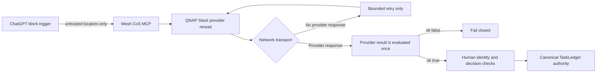

# Security Review v4.2.3: QNAP qnet Egress Readiness

## Applicability

`TARGETED`

The patch changes deployment/runtime verification for an external Slack API call on an MCP authority path. It does not change approval semantics, Slack scopes, credentials, provider decision parsing, public MCP tools, agent allowlists, or ingress architecture.

## Trust boundaries

The release-preparation Mermaid flow was validated with Mermaid Chart. The security property is that retry is permitted only before any provider response exists.

## Security properties

1. Work trigger content remains non-authoritative and locator-only.
2. Slack provider reread remains mandatory before any approval mutation.
3. Only the configured protected human identity can approve, deny, or request change.
4. Slack provider `ok:false` responses never retry and never become PASS through timing tolerance.
5. Malformed provider responses never retry and fail closed.
6. Only network exceptions before a provider response may retry.
7. Retry count and delay are bounded: six total attempts with five-second inter-attempt delay.
8. Retry logs do not contain OAuth tokens, headers, message contents, personal Slack data, or provider response metadata.
9. Exhausted network readiness fails deployment and triggers the existing transactional rollback.
10. No new OAuth scope, token type, Socket Mode path, webhook authority, MCP tool, agent, or network privilege is introduced.

## Production evidence

- Two consecutive v4.2.2 QNAP deployments reached healthy local containers and then failed the live Slack provider-read gate with `network_error` before receiving a Slack response.
- Both deployments rolled back to v4.2.1 without executing a consequential action.
- The exact v4.2.2 image, with the same protected bot token, successfully called Slack when run in the already-stable v4.2.1 `mesh-cos-mcp` network namespace.
- Slack channel availability was independently confirmed through the connected Slack interface.

This evidence isolates the changed behavior to QNAP/qnet egress readiness rather than authorization.

## Review findings

### SEC-V423-001: Retry provider authorization errors

Status: `RESOLVED BY DESIGN`

The implementation does not retry Slack `ok:false` responses. Safe provider error codes remain immediate failures.

### SEC-V423-002: Retry malformed responses

Status: `RESOLVED BY DESIGN`

JSON decode or invalid provider response failures are classified separately and fail immediately.

### SEC-V423-003: Unbounded deployment retry

Status: `RESOLVED BY DESIGN`

The verifier permits six total attempts and five-second inter-attempt delay. Exhaustion fails closed.

### SEC-V423-004: Secret or personal-data logging

Status: `RESOLVED BY DESIGN`

Only static retry metadata and sanitized `[a-z0-9_]+` provider codes are emitted. Existing diagnostic collection continues to exclude secret contents and environment contents.

## Security receipt

- Applicability: `TARGETED`
- Required review: external API/network egress, deployment/runtime, OAuth-bearing Slack boundary, MCP authority path
- New scopes: none
- New credentials: none
- New ingress: none
- New MCP tools or agents: none
- Authorization behavior change: none
- Consequential-action behavior change: none
- Unresolved critical/high findings: none identified in the targeted review
- Codex Security: unavailable in this execution environment; no claim of Codex Security execution is made
- Required independent verification: regression assertions, full repository CI, shell/security gates, exact release bundle, container provenance, and live QNAP deployment verification
