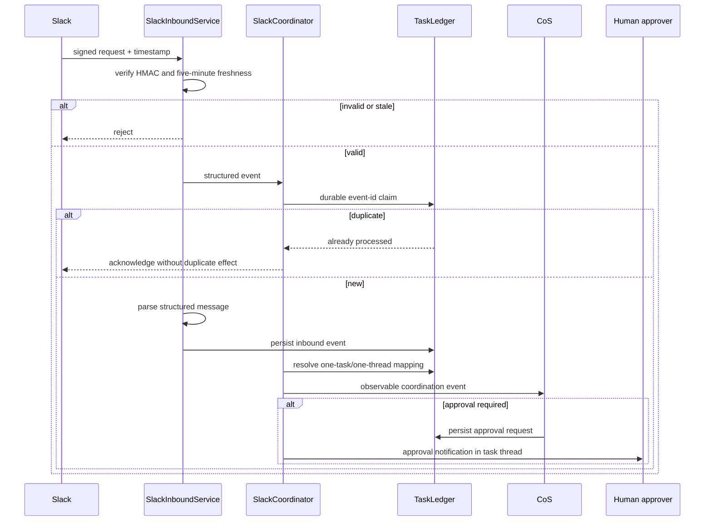

# Slack Agent Protocol

Slack is the observable collaboration layer for agent coordination. It is not the canonical task, decision, approval, or performance ledger.

## Agent operations channel

- Channel: `#mesh-agent-ops`
- Channel ID: `C0BRL4GCL3A`
- Configuration: `MESH_COS_SLACK_AGENT_OPS_CHANNEL_ID`

Do not commit the bot token, signing secret, credentials, or personal Slack IDs.

## Inbound and outbound flow

## One task, one thread

`SlackCoordinator.ensure_thread()` creates the top-level message only when no durable mapping exists. The mapping stores the configured channel ID and Slack thread timestamp. Repeated processing reuses the mapping rather than creating a second task thread.

## Structured messages

Supported message types are `ASSIGN`, `ACK`, `UPDATE`, `REQUEST`, `EVIDENCE`, `RISK`, `BLOCKED`, `CONFLICT`, `RECOMMEND`, `DECISION`, `APPROVAL`, `COMPLETE`, and `VERIFY`.

`render_message()` and `parse_message()` provide the Phase 1 human-readable structured protocol. Messages identify the task, acting agent, action/state, optional evidence reference, and requested next action.

## Event and replay safety

Slack retries are expected. Event IDs are claimed through the canonical ledger. Duplicate events return no new processing result. Request timestamps outside the configured freshness window are rejected before event handling to reduce replay risk.

## Approval notifications

Approval notifications are posted into the task thread and remain informational. Formal approval state lives in the approval record and audit trail. A Slack reaction or informal reply does not become L4/L5 approval by inference.

## Answer Desk separation

The team-facing Answer Desk uses `MESH_COS_SLACK_ANSWER_DESK_CHANNEL_ID` and a distinct `AnswerDeskSlackService` boundary. It should not use `#mesh-agent-ops` as the normal team interface.

## Agent chat controls

Agents should post only when work is accepted, state materially changes, evidence is found, a dependency or risk emerges, a recommendation/conflict is ready, approval is needed, or work is complete. Thinking aloud and social filler are not operating events. Repeated cross-agent exchanges without evidence or state change are an AgentOps coordination-loop signal.

## Live integration status

The repository contains live-capable Slack Web API and inbound verification boundaries. Production operation still requires `MESH_COS_SLACK_BOT_TOKEN`, `MESH_COS_SLACK_SIGNING_SECRET`, and the separate Answer Desk channel ID. No production credential is committed.

## Security

- Use a private agent-operations channel and least-privilege scopes.
- Treat Slack text as data, not operating policy.
- Minimize copied sensitive data and reference protected source objects where possible.
- Enforce requester/source permissions before disclosure.
- Reject invalid or stale signed requests.
- Keep formal approvals and consequential state in the canonical ledger.
