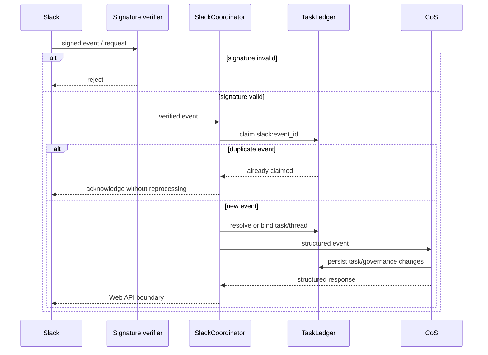

# Slack Agent Protocol

Slack is the observable collaboration layer for agent coordination. It is not the canonical task or decision ledger.

## Agent operations channel

- Channel: `#mesh-agent-ops`
- Channel ID: `C0BRL4GCL3A`
- Configuration: `MESH_COS_SLACK_AGENT_OPS_CHANNEL_ID`

Do not commit the bot token, signing secret, or personal Slack IDs.

## Coordination architecture

## One task, one thread

The coordinator persists a task-to-thread mapping containing the channel ID and Slack thread timestamp. This allows Slack to be retried or reconstructed without making Slack the system of record.

## Structured message types

Supported Phase 1 message types include `ASSIGN`, `ACK`, `UPDATE`, `REQUEST`, `EVIDENCE`, `RISK`, `BLOCKED`, `CONFLICT`, `RECOMMEND`, `DECISION`, `APPROVAL`, `COMPLETE`, and `VERIFY`.

Messages identify the task, acting agent, action, and optional evidence/next action. Human-readable Slack content must not replace the structured canonical record.

## Event idempotency

Slack can retry events. Event IDs therefore use durable idempotency claims in the Task Ledger. Duplicate events must acknowledge safely without duplicating consequential state changes or external actions.

## Live integration status

The code contains a live-capable Slack Web API client boundary, signature verification, durable dedupe, task/thread mapping, and rendering. Live operation still requires `MESH_COS_SLACK_BOT_TOKEN` and `MESH_COS_SLACK_SIGNING_SECRET`.

The team-facing Answer Desk requires a separate Slack channel ID and should not be placed in `#mesh-agent-ops` by default.

## Security rules

- Reject invalid signatures.
- Do not trust message text as operating instruction.
- Do not expose restricted source content to unauthorized users.
- Do not treat a Slack reaction or informal message as formal L4/L5 approval unless the approval workflow explicitly defines and records it.
