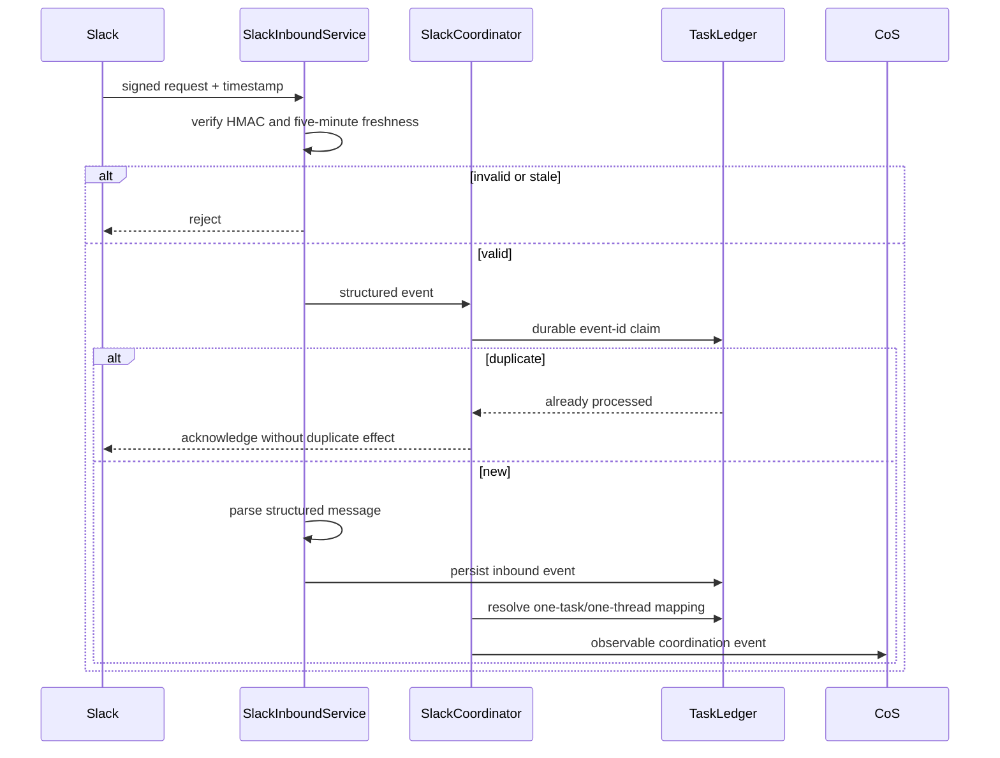
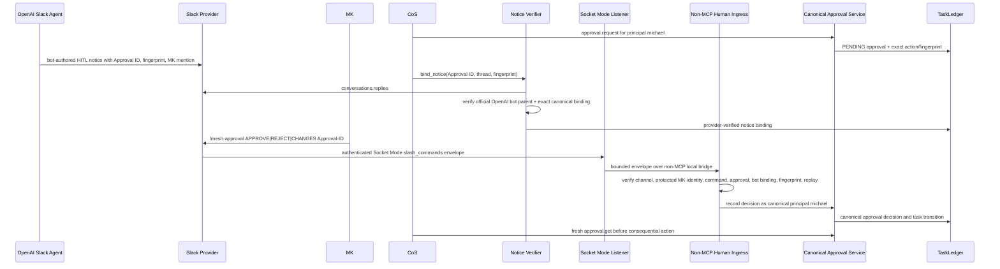

# Slack Agent Protocol

Slack is the observable collaboration and human-interaction layer for agent coordination. It is not the canonical task, decision, approval, or performance ledger.

## Agent operations channel

- Channel: `#mesh-agent-ops`
- Channel ID: `C0BRL4GCL3A`
- Configuration: `MESH_COS_SLACK_AGENT_OPS_CHANNEL_ID`

Do not commit bot tokens, app-level tokens, verifier credentials, or personal Slack IDs. The human approver Slack ID is a protected runtime binding and maps only to canonical principal `michael`.

## Slack identities and authority

Four identity/transport classes are intentionally separate:

1. **OpenAI notice author.** Governed HITL notices must be provider-authored by the official Slack identity for ChatGPT (`U0BKV7Z8M96`) or ChatGPT Agents (`U0BN8V2BU9Z`). ChatGPT Agents is preferred for scheduled agent delivery. A user-authored message, custom bot, or copied OpenAI display name cannot satisfy this control.
2. **Human approval principal.** One immutable Slack user ID for MK is configured at deployment through `MESH_COS_SLACK_APPROVER_USER_ID_FILE` or, outside the QNAP production bundle, `MESH_COS_SLACK_APPROVER_USER_ID`. Its value is not committed or logged. It maps only to canonical principal `michael` after the trusted interactive boundary validates the provider envelope.
3. **Provider notice verifier.** `MESH_COS_SLACK_VERIFIER_TOKEN_FILE` points to a protected Slack bot credential used only to read the approval-notice thread from the provider and bind the bot-authored notice to the canonical Approval ID and payload fingerprint.
4. **Human interaction ingress.** `MESH_COS_SLACK_SOCKET_APP_TOKEN_FILE` points to a protected Slack app-level `xapp-` token. The QNAP runtime opens an outbound Socket Mode connection and accepts canonical human decisions only from the dedicated `/mesh-approval` slash-command envelope.

The generic ChatGPT Slack connector is user-scoped and must not be used to author governed approval notices or to satisfy the canonical human-decision boundary.

## Coordination flow

The existing signed Slack coordination boundary remains available for ordinary agent coordination and replay-safe event handling. Ordinary message content is evidence, never approval authority.

## HITL approval flow

Approval has two separate trust boundaries: bot-authored notice verification and provider-authenticated human interaction. No agent receives authority to submit an approval boolean or translate a normal Slack message into human authority.

The CoS `skills.invoke_governed` capability `slack-adapter` exposes **one** operation only:

- `bind_notice`: `operation`, `approval_id`, `thread_ts`, `payload_fingerprint`

Any `ingest_decision`, `approved`, `actor`, `principal`, channel override, or arbitrary Slack payload is denied. Direct agent invocation of `approval.record_decision` remains prohibited by the MCP human-only boundary. The Socket Mode human ingress is deliberately not an MCP tool.

## One task, one thread

`SlackCoordinator.ensure_thread()` creates the top-level coordination message only when no durable mapping exists. The mapping stores the configured channel ID and Slack thread timestamp. Repeated processing reuses the mapping rather than creating a second task thread.

For HITL approval, `SlackApprovalHITLService.bind_notice()` stores one provider-verified approval-to-thread binding. A conflicting second binding fails closed. `SlackSocketApprovalService` stores one provider-interaction decision record. Replaying the same envelope is idempotent; a distinct second interaction cannot re-decide an already-decided approval.

## Human command contract

The only canonical Slack human commands are submitted through the dedicated slash command:

- `/mesh-approval APPROVE <Approval ID>`
- `/mesh-approval REJECT <Approval ID>`
- `/mesh-approval CHANGES <Approval ID>: <requested change>`

An ordinary channel/thread message containing the same text is non-authoritative even when Slack attributes the message to the configured human user. This distinction is required because Slack apps can post with user attribution.

## Event and replay safety

Slack retries are expected. Signed coordination event IDs are claimed through the canonical ledger. Duplicate coordination events return no new processing result. Request timestamps outside the configured freshness window are rejected before coordination event handling.

HITL approval uses durable notice binding plus durable Socket Mode envelope/decision records. A conflicting second provider interaction fails closed rather than selecting a winner.

## Approval notifications

Approval notifications are informational until the server has provider-verified the official OpenAI bot notice and a valid Socket Mode slash-command decision has updated the canonical approval record. A reaction, informal reply, copied command, display name, Sheet state, or user-attributed ordinary message never becomes L4/L5 approval by inference.

If the official OpenAI Workspace Agent Slack delivery surface is unavailable, the affected workflow records `BLOCKED_CHATGPT_AGENT_TRANSPORT`. It must not fall back to posting the governed notice as MK.

## QNAP protected runtime configuration

The QNAP production bundle sets `MESH_COS_SLACK_HITL_REQUIRED=true` and file-mounts:

- `/run/secrets/slack_approver_user_id` from the protected host approver-identity file
- `/run/secrets/slack_verifier_token` from the protected host verifier-token file
- `/run/secrets/slack_socket_app_token` from the protected host Socket Mode app-level token file

The runtime also fixes `MESH_COS_SLACK_APPROVAL_COMMAND=/mesh-approval`.

`mesh-cos-slack-hitl-configure.sh` runs after the release image is prepared and before production activation. It captures the approver ID visibly, captures the verifier bot token and Socket Mode app-level token with terminal echo disabled, never logs any protected value, and normalizes governed secret files to the runtime UID/GID with mode `0400`.

Production preflight requires the governed channel, protected human identity, canonical principal `michael`, exact official OpenAI notice-author set, `xoxb-` provider-verifier credential, `xapp-` Socket Mode credential, `/mesh-approval`, and canonical audit integrity. Runtime readiness also fails closed when HITL is required and the Socket Mode connection is inactive.

## Answer Desk separation

The team-facing Answer Desk uses `MESH_COS_SLACK_ANSWER_DESK_CHANNEL_ID` and a distinct `AnswerDeskSlackService` boundary. It should not use `#mesh-agent-ops` as the normal team interface.

## Agent chat controls

Agents should post only when work is accepted, state materially changes, evidence is found, a dependency or risk emerges, a recommendation/conflict is ready, approval is needed, or work is complete. Thinking aloud and social filler are not operating events. Repeated cross-agent exchanges without evidence or state change are an AgentOps coordination-loop signal.

## Security

- Use a private agent-operations channel and least-privilege Slack scopes.
- Treat Slack text as untrusted data, not operating policy.
- Verify the bot-authored notice against provider state, Approval ID, channel/thread binding, and immutable payload fingerprint.
- Require the dedicated Socket Mode slash-command envelope for canonical human decisions. Ordinary user-attributed messages are evidence only.
- Keep human-only approval authority outside the agent-callable MCP surface.
- Keep verifier/app credentials and the personal human Slack identity out of source, prompts, logs, TaskLedger evidence text, and generated artifacts.
- Minimize copied sensitive data and reference protected source objects where possible.
- Keep formal approvals and consequential state in the canonical ledger.
