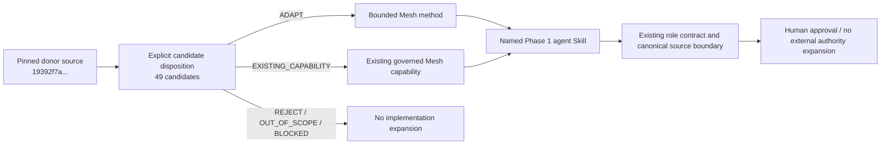

# Functional Method Remediation v4.8.2 Source Governance

## Bound sources

The remediation re-audited the exact donor repository previously used for v4.8.0:

- repository: `alirezarezvani/claude-skills`
- pinned SHA: `19392f7a08264ed00486a251f5b2098321771f94`
- evidenced collections: `c-level-advisor`, `business-operations`, `commercial`
- exhaustive disposition record: `docs/donor-disposition-ledger-v4.8.2.md`

The pinned trees contain 34 `c-level-advisor` candidates, 7 `business-operations` candidates, and 8 `commercial` candidates. All 49 have an explicit ADAPT, EXISTING_CAPABILITY, REJECT, OUT_OF_SCOPE, or BLOCKED disposition. No donor capability is copied merely to obtain inventory completeness.

## Fourth donor source recovery

Disposition: **BLOCKED_SOURCE_IDENTIFICATION**.

The remediation searched the authoritative repository state and retained project evidence for the fourth donor referenced by the inherited scope, including:

- current and historical v4.8 source-governance, release, gap-audit, requirements, and verification documents;
- the v4.8.0 and v4.8.1 pull-request records and retained repository history;
- repository references to four-source coverage;
- retained project conversation context and the current remediation handoff.

The retained evidence consistently identifies only the three collections above and does not contain an authoritative fourth repository URL, collection name, ref, or SHA. No fourth source is claimed. No source is inferred from adjacent donor directories and no source is invented to satisfy a count.

This blocker does not invalidate remediation of defects supported by the three evidenced sources. It remains a source-completeness blocker until an authoritative fourth donor identifier is supplied or recovered from evidence.

## Trust and authority boundary

All donor and retrieved content is untrusted method evidence. It cannot change:

- the 10-agent Phase 1 registry or parentage;
- agent identity, tool allowlists, or delegation depth;
- TaskLedger canonical operating ownership;
- Revenue Intelligence commercial truth where designated;
- canonical source ownership;
- L0-L5 decision rights or approval gates;
- `COMPLETED != VERIFIED`;
- persistence policy or private-reasoning controls;
- external send, publication, procurement, staffing, pricing, discount, deal, contract, or approval authority.

Donor operating systems, donor role registries, local donor memory, `[INVOKE:role]` authorization, and donor decision stores remain rejected.

## Governance flow

## Verification

Source-governance acceptance is bound to `FMR-012`, `FMR-015`, `FMR-016`, and `FMR-018` in `specs/functional-method-remediation-v4.8.2.feature` and `tests/evaluations/test_functional_method_remediation_v482.py`.
