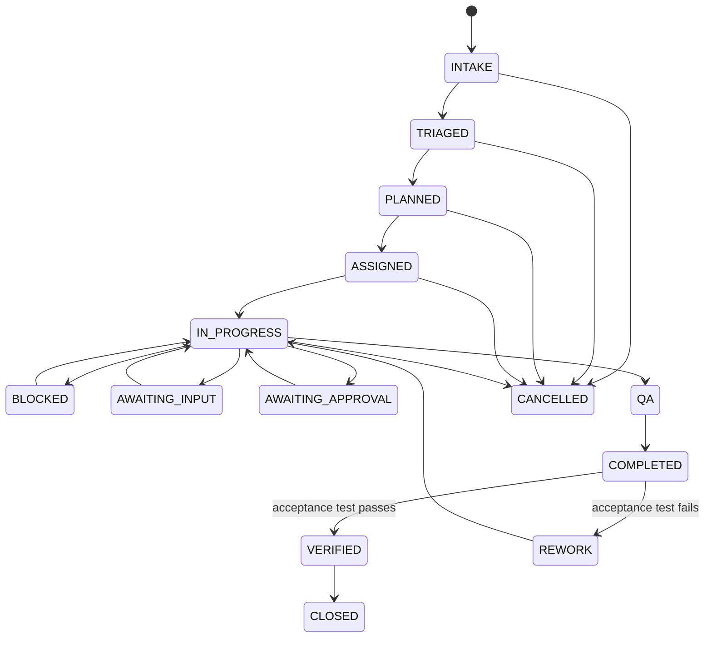
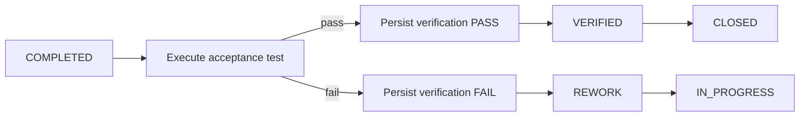

# Task Lifecycle

The task lifecycle is the canonical state model for Phase 1 work. State changes are controlled by the runtime service and persisted to the Task Ledger. Slack messages do not create canonical state by themselves.

## State model

## State semantics

| State | Meaning |
|---|---|
| `INTAKE` | Outcome request exists and has been durably recorded. |
| `TRIAGED` | Scope, authority, urgency, and likely owner have been evaluated. |
| `PLANNED` | Expected outcome, work packages, dependencies, and acceptance criteria are defined. |
| `ASSIGNED` | One accountable owner has accepted or been assigned responsibility. |
| `IN_PROGRESS` | Work is actively being executed. |
| `BLOCKED` | Progress is prevented by a material dependency or constraint. |
| `AWAITING_INPUT` | Required evidence or input is missing. |
| `AWAITING_APPROVAL` | Required human approval has not yet been resolved. |
| `QA` | Deliverable is undergoing quality/evidence checks before completion. |
| `REWORK` | Completion failed the acceptance test and must be remediated. |
| `READY_FOR_DECISION` | A decision package exists where a decision, not execution, is the next step. |
| `READY_FOR_ACTION` | Approved execution is ready where action, not analysis, is the next step. |
| `COMPLETED` | Deliverable and evidence were produced. This is not verified outcome completion. |
| `VERIFIED` | The explicit acceptance test passed and a verification record exists. |
| `CLOSED` | Verified work is administratively closed. |
| `CANCELLED` | Work was intentionally terminated and must not continue execution. |

## Verification contract

`COMPLETED != VERIFIED` is a constitutional rule.

The Chief of Staff service records the completion outcome and evidence, then executes the task's acceptance check. The verification record includes the pass/fail result and evidence reference. A failed check routes the task to `REWORK` rather than allowing a false positive completion.

## Audit requirement

Consequential state changes must be attributable to the acting service/agent and captured in durable audit/event state. A task must be reloadable from the ledger without depending on conversation history.

## Operational rules

- Every task has exactly one accountable owner.
- Delegation cannot create a second active owner for the same scope.
- Approval requirements remain in force through rework and reassignment.
- A retry cannot silently repeat a consequential action.
- A Slack thread reflects task state but cannot override it.
