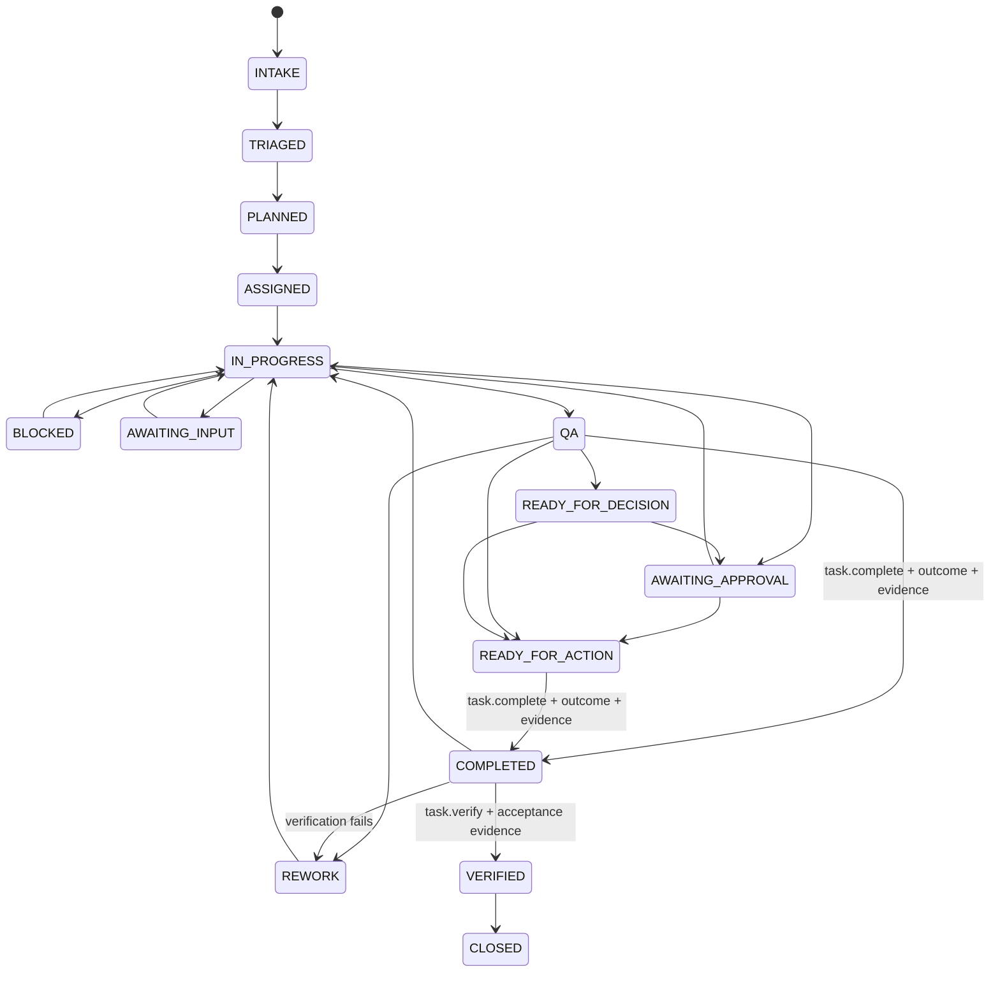

# Task Lifecycle

The task lifecycle is the canonical Phase 1 state model. State changes are controlled by the runtime and persisted to `TaskLedger`. ChatGPT or Slack text does not create canonical state by itself.

## State model

## Accountable-owner completion

`task.complete` is the canonical operation for an accountable owner to persist completed work. Runtime authorization requires the caller to be the task's accountable owner or CoS. The completion transition requires:

- an acceptance test on the task;
- a non-empty outcome;
- one or more supporting evidence references;
- a valid transition into `COMPLETED`.

Successful completion sets `completed_at` and persists `COMPLETED`. It never sets `VERIFIED`.

A duplicate completion attempt from an already completed task fails as an invalid state transition and cannot silently modify verification state.

## Independent verification

`task.verify` is a distinct operation. In the Phase 1 MCP projection only Chief of Staff is expressly allowed to invoke it. Passing verification requires:

- a completed task;
- a non-empty verification reason;
- explicit acceptance evidence;
- an authenticated verifier identity.

A passing result transitions `COMPLETED -> VERIFIED`. A failed acceptance result transitions `COMPLETED -> REWORK`. Verification evidence and verifier identity are persisted separately from owner completion evidence.

**COMPLETED != VERIFIED.**

## Parent and child behavior

Child completion or verification never automatically changes the parent state. The parent must independently reach its completion requirements and pass its own acceptance test. A failed child cannot silently produce parent verification.

## Invalid transitions

The runtime rejects invalid transitions before persistence. Missing completion evidence, missing passing-verification evidence, and unauthorized verifier requests fail closed and leave canonical task state unchanged.