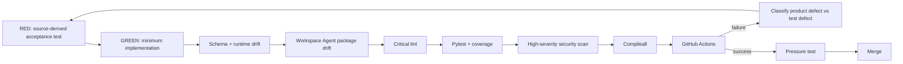

# Testing and Evaluation

Phase 1 development uses explicit red-green-refactor loops. Behavioral changes begin with an executable expectation, then the minimum implementation, then refactoring while preserving contracts, governance, security, and documentation alignment.

## Verification pipeline



## Release commands

```bash
python3 -m venv .venv
source .venv/bin/activate
pip install -e '.[dev]'
python -m pip check
python scripts/validate-contracts.py
python scripts/check-runtime-doc-drift.py
python scripts/check-chatgpt-packages.py
ruff check src tests scripts --select E9,F63,F7,F82
pytest --cov=mesh_cos --cov-report=term-missing --cov-fail-under=55
bandit -q -r src -lll
python -m compileall -q src
```

## Test layers

### Contracts and governance

The original v1 schemas remain backward-compatible. Governance adds `decision.v2` and `agent-event.v2` as closed schemas. `tests/integration/test_governance.py` verifies canonical decision persistence, L4/L5 fail-closed behavior, idempotent audit events, SHA-256 hash-chain integrity, shared governance policy injection, Sheet mirror configuration, and the rule that `TaskLedger` remains canonical.

### Canonical role-model integrity

`tests/evaluations/test_phase1_role_model_consistency.py` verifies stable organizational display names, independent `MAJOR.MINOR.PATCH` implementation metadata, complete Phase 1 capability surfaces, package/runtime release alignment, and the authority boundaries for CRO, CFO, COO, Consultant Network Steward, CMO, and VP Content.

### Workspace Agent package acceptance

`tests/evaluations/test_chatgpt_workspace_agent_packages.py` starts from the canonical registry and verifies:

- all 11 Phase 1 roles have one OpenAI Skill and one Workspace Agent manifest,
- Skill frontmatter and `agents/openai.yaml` follow the OpenAI Skill layout,
- display name, parent, implementation version, domain, decision authority, approvals, prohibited actions, and delegation depth match the raw canonical registry,
- every manifest retains mandatory governance and Workspace write actions default to `ALWAYS_ASK`,
- per-agent MCP allowlists are least-privilege,
- only CoS receives task reassignment authority,
- Message Operations can read approval state but cannot decide approvals,
- risky app surfaces remain fail-closed,
- Answer Desk Slack remains disabled until a dedicated channel ID exists,
- exact Agent Builder configuration is present rather than relying on prompt-only personas,
- the final Workspace Agent builder handoff prompt contains the required controls and negative tests.

### MCP runtime safety

`tests/evaluations/test_workspace_agent_mcp_runtime.py` covers the remote-safe task verification path. A Workspace Agent cannot pass the in-process Python acceptance callback used by the local runtime. `ChiefOfStaffService.record_verification_result()` therefore requires an explicit verifier identity and evidence references. A passing verification with no evidence raises and leaves the task `COMPLETED`; a valid result persists the verifier/source/evidence and transitions to `VERIFIED`.

`WorkspaceAgentMCPPolicy` is also tested for deny-by-default behavior. Unknown agents, unknown tools, and unlisted tools fail. Declared runtime bindings must resolve before the MCP contract can pass CI.

### Runtime/documentation drift

`scripts/check-runtime-doc-drift.py` verifies schema closure/versioning, runtime AgentRecords, canonical role identities, required role capabilities, release alignment, representative runtime contract payloads, governance-policy injection, v2 decision/audit behavior, configured governance Sheet IDs, Slack/MCP configuration, and required documentation tokens.

### Workspace Agent package drift

`scripts/check-chatgpt-packages.py` independently verifies the deployment projection. It compares all 11 Workspace Agent manifests to raw registry authority, checks Skill structure, release version `0.2.0`, `mesh-cos-mcp` runtime bindings and per-agent allowlists, builder-field consistency, Answer Desk Slack gating, risky connector constraints, and the builder handoff prompt. CI fails if Builder configuration becomes broader than the canonical contract.

## TDD / loop-engineering record for release 0.2.0

The Workspace Agent increment began with an acceptance-test-only commit. The first CI run was intentionally RED because none of the 11 Skills, manifests, MCP contract, or builder handoff existed. The loop then surfaced and closed additional requirements gaps:

1. **Missing MCP discovery and approval-read tools.** Added `registry.list_agents` and read-only `approval.get`.
2. **Builder-only permissions were insufficient.** Added server-side `WorkspaceAgentMCPPolicy` with deny-by-default allowlists and binding validation.
3. **Remote verification could not pass a Python callable.** Added evidence-backed `record_verification_result()` and tests that fail closed without evidence.
4. **A test compared human-readable authority to normalized runtime authority.** Classified as a test defect and corrected to compare exact Builder governance against the raw registry contract while retaining normalized-runtime tests elsewhere.
5. **Release provenance drift.** Advanced package/runtime/Workspace Agent/MCP release to `0.2.0` and added release drift gates.
6. **App write surfaces required product-specific constraints.** Added per-role Connector Action Constraints and default Workspace **Always ask** behavior.

The loop continues until both repository CI and post-merge `main` CI are green. Product-side creation remains a separate Workspace Agent builder step and requires preview testing before publication.

## OpenAI Skill validation

Each role Skill is initialized through the OpenAI skill-creator structure, validated with `quick_validate.py`, and packaged with `package_skill.py` into `skill.zip`. Validation covers YAML frontmatter, naming, required `SKILL.md`, required `agents/openai.yaml`, and package structure. Skill packaging does not prove external app connectivity or a deployed MCP endpoint.

## Original Phase 1 evaluations

The original 13 scenarios remain in the suite: routine team question, pricing escalation, CRO/CFO conflict, infeasible staffing, stale consultant availability, content approval gate, WATCH after repeated poor work, QUARANTINE after critical defect, Slack duplicate delivery, coordination loop, missing source authority, high-impact/low-confidence escalation, and failed outcome verification returning to REWORK.

## Test integrity

Tests must not fabricate production credentials, weaken authority or approval policy, turn ChatGPT, Slack, or Google Sheets into canonical state, persist private reasoning traces, claim an MCP/app integration is live when only a contract/stub exists, or turn product-side `Always ask` approval into a replacement for Mesh L4/L5 governance.
