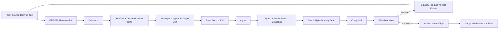

# Testing and Evaluation

Release `v1.0.0` uses explicit red-green-refactor loops and a fail-closed release pipeline. Behavioral changes begin with an executable expectation, then the minimum implementation, then refactoring while preserving contracts, governance, security, Workspace Agent packaging, and documentation alignment.

## Verification pipeline



## Release commands

```bash
python3 -m venv .venv
source .venv/bin/activate
pip install -e '.[dev]'
python -m pip check
python scripts/validate-contracts.py
python scripts/check-runtime-doc-drift.py
python scripts/check-chatgpt-packages.py
ruff check src
ruff check tests scripts --select E9,F63,F7,F82
mypy src --check-untyped-defs
pytest --cov=mesh_cos --cov-report=term-missing --cov-report=xml --cov-fail-under=100
bandit -q -r src -lll
python -m compileall -q src
```

## v1.0.0 release acceptance

The `mesh_cos` package must remain at 100% branch-aware coverage. The purpose is not cosmetic coverage inflation. The loop removes dead/unreachable code when appropriate and adds behavior-oriented tests for reachable production paths.

The production-hardening loop added or strengthened tests for:

- serialized MCP runtime composition and exact contract/handler parity;
- deny-by-default agent and human principal authorization;
- L4 approval evidence and Michael-exclusive L5 authority;
- human actor spoofing prevention;
- server-derived agent identity and provenance;
- server-owned replay executors and rejection of client-supplied executable replay mechanisms;
- accountable-owner `task.complete` and independent `task.verify` separation;
- atomic Slack and governance-event idempotency;
- kill-switch enforcement;
- retry, timeout, replay, override, and durable failure paths;
- naive/aware timestamp compatibility;
- fail-closed empty source allowlists;
- decomposition atomicity;
- audit-chain ordering and integrity;
- registry, Skill, Workspace Agent manifest, MCP allowlist, and release-version consistency;
- production-preflight success and failure paths.

## Test layers

### Contracts and governance

Versioned schemas preserve backward compatibility. `decision.v2` and `agent-event.v2` remain closed governance contracts. Tests verify canonical decision persistence, L4/L5 fail-closed behavior, idempotent audit events, SHA-256 hash-chain integrity, shared governance policy injection, mirror configuration, and the rule that `TaskLedger` remains canonical.

### Canonical role-model integrity

Role-model tests verify stable organizational display names, independent `MAJOR.MINOR.PATCH` implementation metadata, complete Phase 1 capability surfaces, repository/runtime release alignment, and authority boundaries for CRO, CFO, COO, Consultant Network Steward, CMO, VP Content, Devil's Advocate, AgentOps, Answer Desk, Message Operations, and Chief of Staff.

### Workspace Agent package acceptance

`tests/evaluations/test_chatgpt_workspace_agent_packages.py` and `scripts/check-chatgpt-packages.py` verify all 11 role Skills/manifests, exact registry authority, release `1.0.0`, production-readiness references, Builder configuration, MCP allowlists, human-only tool separation, connector constraints, Answer Desk Slack gating, and stable role naming.

### MCP runtime safety

`MCPRuntime` is tested as the serialized remote composition boundary. Unknown principals, unknown tools, non-allowlisted tools, quarantined/retired agents, authority claims above the role ceiling, missing L4 approval evidence, non-Michael L5 claims, and agent attempts to call human-only operations fail closed.

Replay tests verify that remote callers cannot inject a Python callable, import path, shell command, or source-text execution mechanism. Only a server-registered executor referenced by canonical failure state can run.

### Completion versus verification

Accountable owners may use `task.complete` to persist outcome/evidence and reach `COMPLETED`. Verification is separate. Passing verification without evidence fails closed. Failed acceptance routes to `REWORK`. An agent cannot self-certify missing evidence into `VERIFIED`.

### Runtime/documentation drift

`scripts/check-runtime-doc-drift.py` verifies schema closure/versioning, runtime AgentRecords, role identities/capabilities, representative contract payloads, governance-policy injection, decision/audit behavior, Slack/MCP configuration, and required documentation invariants.

### Production preflight

`ProductionPreflight` tests kill-switch state, HTTPS MCP URL validation, canonical 11-agent registry/health, MCP contract/runtime binding resolution, serialized runtime composition, optional Slack requirements, optional Answer Desk channel, and optional audit-chain integrity. Failed preflight blocks activation.

## TDD / loop-engineering record

The initial Workspace Agent package increment was released as `0.2.0`. The subsequent production-hardening loop intentionally raised the bar rather than merely incrementing documentation. It surfaced and closed split-write idempotency windows, remote replay safety, remote completion semantics, human-principal spoofing, MCP composition ambiguity, authority-claim spoofing, timestamp compatibility faults, source-allowlist widening, partial decomposition persistence, record-ordering drift, and missing production-preflight composition checks.

The resulting repository release is `1.0.0`. See `production-hardening-2026-08-17.md` and `release-1.0.0-production-readiness.md`.

## OpenAI Skill validation

Each role Skill follows the OpenAI Skill package layout and is validated/repackaged after changes. Every role Skill includes `references/production-readiness.md`. Skill packaging does not prove external app connectivity or a deployed MCP endpoint, which remain activation dependencies.

## Original Phase 1 evaluations

The original 13 representative scenarios remain in the suite: routine team question, pricing escalation, CRO/CFO conflict, infeasible staffing, stale consultant availability, content approval gate, WATCH after repeated poor work, QUARANTINE after critical defect, Slack duplicate delivery, coordination loop, missing source authority, high-impact/low-confidence escalation, and failed outcome verification returning to REWORK.

## Test integrity

Tests must not fabricate production credentials, weaken authority or approval policy, turn ChatGPT, Slack, or Google Sheets into canonical state, persist private reasoning traces, claim an MCP/app integration is live when only a contract exists, or treat Workspace `Always ask` as a replacement for Mesh L4/L5 governance.
