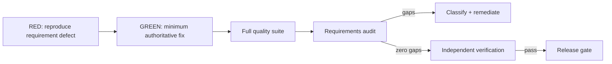

# Testing and Evaluation

Release `v4.0.0` uses BDD acceptance scenarios, TDD, deterministic red-green-refactor loops, requirements traceability, and a separate verification gate.

## Engineering loop



The first remediation test commit intentionally failed against the prior architecture for the correct reasons: roster count, stale production-readiness count, human-only role-contract leakage, and owner completion-contract drift.

## BDD scenarios

The automated suite proves:

- Given the Phase 1 registry, when runtime packages load, then exactly 10 registered agents exist and Mesh Devil's Advocate is external to that count.
- Given any agent identity, when a human-only operation is requested, then execution is denied.
- Given an authenticated human principal, when an allowed human-only operation is requested, then the human path can execute it.
- Given spoofed prompt/task identity text, when governance is recorded, then runtime actor identity remains the bound agent.
- Given an accountable owner at QA with outcome and evidence, when `task.complete` executes, then state becomes `COMPLETED` only.
- Given a completed task and an unauthorized owner, when `task.verify` is requested, then authorization fails.
- Given CoS and explicit acceptance evidence, when `task.verify` passes, then state becomes `VERIFIED`.
- Given `CoS -> COO -> Consultant Network Steward`, when depth-2 delegation is created, then it succeeds; any further Steward delegation fails.
- Given a stale consultant availability timestamp, when readiness is calculated, then status is `REQUIRES_REFRESH`.
- Given a Devil's Advocate challenge, when it runs through the governed Skill path, then it remains advisory and canonical task state is unchanged.
- Given a failed child acceptance test, when parent verification is attempted, then the parent cannot silently become verified.

## End-to-end certification

`tests/integration/test_cos_delegation_certification_v4.py` uses synthetic data to exercise Michael-requested outcome establishment, CoS intake/decomposition, CRO/CFO/COO delegation, COO -> Consultant Network Steward delegation, governed Devil's Advocate invocation, evidence-backed sub-agent completion, AgentOps observation, CoS synthesis, independent CoS verification, and audit-chain verification.

It also contains negative scenarios for missing evidence, duplicate completion, self-verification, authority widening, approval-gate weakening, excessive depth, stale consultant readiness, and child-failure propagation.

## Release suite

```bash
python -m pip check
cd mcp && npm ci && npm run check && cd ..
python scripts/validate-contracts.py
python scripts/check-runtime-doc-drift.py
python scripts/check-chatgpt-packages.py
ruff check src
ruff check tests scripts --select E9,F63,F7,F82
mypy src --check-untyped-defs
pytest --cov=mesh_cos --cov-report=term-missing --cov-report=xml --cov-fail-under=100
bandit -q -r src -lll
python -m compileall -q src
```

`npm run check` includes TypeScript compilation, Node MCP tests, real local stdio certification, and npm audit. Python coverage remains 100% branch-aware.

## Drift checks

`check-chatgpt-packages.py` enforces exact agreement among registry principals, role Skills, Workspace manifests, MCP allowlists, human-only exclusion, verifier exposure, release versions, and current documentation roster statements.

`check-runtime-doc-drift.py` independently instantiates the serialized runtime, certifies the 10-agent roster, executes owner completion plus separate verification, confirms unauthorized self-verification denial, and verifies the governance audit chain.

Green tests alone are not sufficient. The requirements gap audit and independent verification must also report zero known defects before merge.