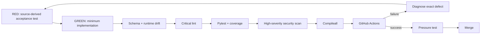

# Testing and Evaluation

Phase 1 development uses explicit red-green-refactor loops. Behavioral changes begin with an executable expectation, then the minimum implementation, then refactoring while preserving contracts and governance.

## Verification pipeline



## Release commands

```bash
python3 -m venv .venv
source .venv/bin/activate
pip install -e '.[dev]'
python -m pip check
python scripts/validate-contracts.py
python scripts/check-runtime-doc-drift.py
ruff check src tests scripts --select E9,F63,F7,F82
pytest --cov=mesh_cos --cov-report=term-missing --cov-fail-under=55
bandit -q -r src -lll
python -m compileall -q src
```

## Test layers

### Contracts

The original v1 schemas remain backward-compatible. Governance adds `decision.v2` and `agent-event.v2` as closed schemas with positive fixtures. The v2 contracts reject undeclared fields, including attempts to add private chain-of-thought fields to a decision record.

### Governance journal

`tests/integration/test_governance.py` verifies that:

- explainable `decision.v2` records persist canonically,
- human-approval-required decisions fail closed without approval reference and approver,
- v2 audit events are idempotent and durable,
- consecutive audit events form a SHA-256 hash chain,
- mutation of an audit event causes `verify_audit_chain()` to fail,
- every registered agent inherits `governance-journal` and the v2 output contracts,
- Google Sheets mirror configuration contains the expected non-secret Sheet IDs,
- `TaskLedger` remains canonical and Sheets remain human-readable operational mirrors.

### Canonical role-model integrity

`tests/evaluations/test_phase1_role_model_consistency.py` protects the Phase 1 organizational model. It verifies:

- the canonical display names for CRO, CFO, COO, Consultant Network Steward, CMO, and VP Content,
- implementation versions are separate `MAJOR.MINOR.PATCH` metadata,
- the runtime loader rejects display names that embed implementation-version labels,
- package and runtime release versions stay aligned,
- the repository contains no legacy version-bearing CFO/COO role-name references,
- each of the six roles exposes the complete permitted-action set required by its Phase 1 accountability,
- CFO, COO, Consultant Network Steward, CMO, and VP Content retain their human-approval and authority boundaries.

The role-model increment began RED. Its first CI run failed four acceptance checks against the pre-change registry and documentation, including role-name drift, missing executable capability coverage, and CFO accountable-domain drift. The implementation then reconciled runtime policy, role cards, documentation, package versioning, and drift gates before returning the suite to GREEN.

### Backward compatibility

Existing `mesh.cos.agent-event.v1` producers continue to work. A compatibility bridge dual-writes successful legacy audit events into the v2 governance stream. Existing v1 decision records remain available while material conflict decisions additionally produce `decision.v2` records.

### State and authority

State-machine tests reject invalid lifecycle changes. Authority tests enforce L0-L5 boundaries, delegation depth, approval inheritance, source/tool allowlists, prompt-injection boundaries, and fail-closed consequential actions.

### Management services

Stateful tests exercise CoS intake, work decomposition, dependencies, reassignment, delegation, functional invocation, verification/rework, conflicts, approvals, Answer Desk, AgentOps, retries, timeouts, leases, metrics, and audit state.

### Source-derived final closure

The final Phase 1 TDD loop added tests for AgentRecord timestamps and runtime contract parity, full material-conflict/source-authority records, Slack freshness/replay rejection, AgentOps defect signals, partial-failure replay and human override, exact Phase 1 instrumentation, persistent delegated work, and governed existing-skill binding.

### Governance TDD loop

The explainability/audit increment began with failing acceptance tests before implementation. The first implementation CI loop exposed an over-broad test that incorrectly rejected the policy words `credentials` and `tokens` in the non-secret configuration. The test was corrected to detect actual secret-value keys rather than legitimate prohibition vocabulary, then the implementation loop continued. This preserves the distinction between a real security failure and a false-positive test condition.

### Original 13 evaluation scenarios

The original scenarios remain in the suite: routine team question, pricing escalation, CRO/CFO conflict, infeasible staffing, stale consultant availability, content approval gate, WATCH after repeated poor work, QUARANTINE after critical defect, Slack duplicate delivery, coordination loop, missing source authority, high-impact/low-confidence escalation, and failed outcome verification returning to REWORK.

## Drift gate

`scripts/check-runtime-doc-drift.py` verifies schema closure/versioning, runtime AgentRecords, canonical role identities, required Phase 1 role capabilities, package/runtime release alignment, representative runtime contract payloads, governance-policy injection, v2 decision/audit behavior, configured governance Sheet IDs, Slack configuration, and key documentation tokens. This prevents documentation, role cards, or human-readable mirrors from becoming a silent competing contract.

## Test integrity

Tests must not fabricate production credentials, weaken authority or approval policy, turn Slack or Google Sheets into canonical state, persist private reasoning traces, or claim an external integration is live when an injected adapter/stub is used.
