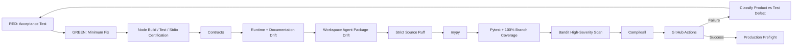

# Testing and Evaluation

Release `v3.0.0` uses explicit red-green-refactor loop engineering with fail-closed release gates. Behavioral changes begin with executable expectations, then the minimum implementation, then refactoring while preserving contracts, governance, authority, Workspace Agent packaging, local MCP behavior, shared Skill boundaries, and documentation alignment.

## Verification pipeline



## Release commands

```bash
python -m pip check
cd mcp
npm ci
npm run check
cd ..
python scripts/validate-contracts.py
python scripts/check-runtime-doc-drift.py
python scripts/check-chatgpt-packages.py
ruff check src
ruff check tests scripts --select E9,F63,F7,F82
mypy src --check-untyped-defs
pytest --cov=mesh_cos --cov-report=term-missing --cov-report=xml --cov-fail-under=100
bandit -q -r src -lll
python -m compileall -q src
```

## Local MCP test layers

The `mcp/` package is validated independently and end to end through TypeScript compilation, Node unit tests, a real `LOCAL_STDIO` client/server smoke certification, canonical persistence through `MCPRuntime`, safe denial behavior, and npm security audit. The TypeScript layer remains transport only.

## Workspace Agent and shared Skill acceptance

`tests/evaluations/test_chatgpt_workspace_agent_packages.py`, `tests/evaluations/test_local_chatgpt_mcp_projection.py`, the shared Message Operations evaluation tests, and `scripts/check-chatgpt-packages.py` verify the **9** repository-local role Skills and Workspace Agent manifests, exact registry authority, release `3.0.0`, local stdio launch metadata, shared canonical ledger configuration, exact MCP allowlists, human-only separation, connector constraints, and stable role naming.

The gates prove that neither `devils-advocate` nor `message-ops` remains a registered principal, Workspace Agent, MCP principal, or repository-local duplicate shared Skill.

**Mesh Devil's Advocate** must remain external, advisory-only, and entitled only to Chief of Staff and CRO.

**Mesh Message Operations** must remain external, approval-bound execution only, and entitled only to Chief of Staff, CRO, and CMO. VP Content must remain drafting-only. Tests must prove exact approval binding, material-change invalidation, preflight, kill-switch/cancellation checks, documented connector action requirements, idempotency, per-attempt receipts, and observed-state verification. Requested, scheduled, sent, delivered, and replied states must not be conflated.

## MCP runtime safety

`MCPRuntime` remains the serialized execution boundary. Unknown identities/tools, non-allowlisted tools, quarantined/retired agents, authority claims above role ceiling, missing L4 approval, non-Michael L5 claims, and agent attempts to call human-only operations fail closed.

`approval.record_decision` and `reliability.human_override` remain human-only.

Replay tests verify callers cannot inject Python callables, import paths, shell commands, or source-text execution mechanisms. Only a server-registered executor referenced by canonical failure state may run.

## Contracts and governance

`decision.v2` and `agent-event.v2` remain closed governance contracts. Tests verify canonical decision persistence, L4/L5 fail-closed behavior, idempotent audit events, hash-chain integrity, governance policy, and the rule that `TaskLedger` remains canonical.

The shared Message Operations contracts remain `mesh.messaging.execution-request.v1` and `mesh.messaging.execution-receipt.v1`. Entitlement or connector access cannot substitute for approval.

## Completion versus verification

Accountable owners may use `task.complete` to persist outcome and evidence and reach `COMPLETED`. Verification remains separate. Failed acceptance routes to `REWORK`. An agent cannot self-certify missing evidence into `VERIFIED`.

## Runtime/documentation drift

`scripts/check-runtime-doc-drift.py` verifies release `v3.0.0`, the 9-agent canonical roster, both shared capability entitlements, schema closure/versioning, runtime AgentRecords, role identities/capabilities, local MCP transport, runtime identity binding, ledger binding, representative governance payloads, mirror configuration, and current documentation invariants.

## Production preflight

`ProductionPreflight` validates kill-switch state, canonical registry/health, local MCP contract/package composition, shared capability topology, runtime bindings, canonical ledger configuration, optional Slack requirements, optional Answer Desk channel, and optional audit-chain integrity. Failed preflight blocks activation.

## TDD and loop-engineering record

The `v3.0.0` Message Operations refactor began with intentionally failing acceptance tests against the former 10-agent architecture. Iterative CI loops remove the local Message Operations principal, reconcile the 9-agent registry and Workspace projection, preserve governed shared-Skill access only for Chief of Staff, CRO, and CMO, and correct release/documentation drift without weakening gates.

The loop is complete only when Node checks, Python checks, package/drift checks, **100% branch-aware `mesh_cos` coverage**, security scans, and post-merge `main` CI are green.

## Test integrity

Tests must not fabricate credentials, weaken authority or approval policy, turn ChatGPT/Slack/Google Sheets into canonical state, persist private reasoning traces, claim connector delivery without observed evidence, or treat Workspace `Always ask` as a replacement for Mesh L4/L5 governance.
