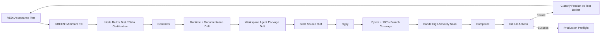

# Testing and Evaluation

Release `v2.0.0` uses explicit red-green-refactor loop engineering with fail-closed release gates. Behavioral changes begin with executable expectations, then the minimum implementation, then refactoring while preserving contracts, governance, authority, Workspace Agent packaging, local MCP behavior, shared Skill boundaries, and documentation alignment.

## Verification pipeline



## Release commands

```bash
python3 -m venv .venv
source .venv/bin/activate
pip install -e '.[dev]'
python -m pip check
cd mcp
npm ci
npm run check
cd ..
python scripts/validate-contracts.py
python scripts/check-runtime-doc-drift.py
python scripts/check-chatgpt-packages.py
ruff check src
ruff check tests scripts --select E9,F63,F7,F82
mypy src --check-untyped-defs
pytest --cov=mesh_cos --cov-report=term-missing --cov-report=xml --cov-fail-under=100
bandit -q -r src -lll
python -m compileall -q src
```

## Local MCP test layers

The `mcp/` package is validated independently and end to end:

- TypeScript compile;
- Node unit tests for contract loading, agent identity, exact tool projection, human-only exclusion, argument bounds, safe errors, Python environment, and transport drift;
- real `LOCAL_STDIO` MCP client/server smoke certification;
- canonical task persistence across separate MCP calls through `mesh_cos.mcp_stdio_bridge` and `MCPRuntime`;
- safe denial behavior for unauthorized calls;
- npm audit with high-severity failure threshold.

The TypeScript layer is transport only. Tests ensure business and governance logic stays in `MCPRuntime`.

## Workspace Agent and shared Skill acceptance

`tests/evaluations/test_chatgpt_workspace_agent_packages.py`, `tests/evaluations/test_local_chatgpt_mcp_projection.py`, and `scripts/check-chatgpt-packages.py` verify the **10** repository-local role Skills/manifests, exact registry authority, release `2.0.0`, local stdio launch metadata, per-agent `MESH_COS_AGENT_ID`, shared canonical ledger configuration, exact MCP allowlists, human-only separation, connector constraints, Answer Desk Slack gating, and stable role naming.

The same gates verify that the former repository-local Devil's Advocate principal, role card, Workspace manifest, MCP principal, and duplicate local Skill are absent. The external **shared Devil's Advocate** capability is represented as **Mesh Devil's Advocate**, is available only to Chief of Staff and CRO, and is advisory-only. Its output cannot overwrite canonical facts or authorize external action.

## MCP runtime safety

`MCPRuntime` remains the serialized execution boundary behind the local MCP. Unknown identities, unknown tools, non-allowlisted tools, quarantined/retired agents, authority claims above the role ceiling, missing L4 approval evidence, non-Michael L5 claims, and agent attempts to call human-only operations fail closed.

Replay tests verify that callers cannot inject Python callables, import paths, shell commands, or source-text execution mechanisms. Only a server-registered executor referenced by canonical failure state may run.

## Contracts and governance

`decision.v2` and `agent-event.v2` remain closed governance contracts. Tests verify canonical decision persistence, L4/L5 fail-closed behavior, idempotent audit events, SHA-256 hash-chain integrity, shared governance policy injection, mirror configuration, and the rule that `TaskLedger` remains canonical.

For challenge work, the registry and deployment projection preserve `mesh.devils-advocate.challenge-request.v1` as the request contract and `mesh.devils-advocate.challenge-packet.v1` as the advisory response contract. Revenue Intelligence remains canonical for commercial evidence, scores, stage, lifecycle, queue state, and activation readiness.

## Completion versus verification

Accountable owners may use `task.complete` to persist outcome and evidence and reach `COMPLETED`. Verification remains separate. Passing verification without evidence fails closed. Failed acceptance routes to `REWORK`. An agent cannot self-certify missing evidence into `VERIFIED`.

## Runtime/documentation drift

`scripts/check-runtime-doc-drift.py` verifies release `2.0.0`, the 10-agent canonical roster, shared Mesh Devil's Advocate entitlements, schema closure/versioning, runtime AgentRecords, role identities/capabilities, local MCP transport and entry point, agent identity binding, ledger binding, representative governance payloads, mirror configuration, and current documentation invariants. It also prevents `MESH_COS_MCP_SERVER_URL` from returning as a ChatGPT-local requirement.

## Production preflight

`ProductionPreflight` validates kill-switch state, canonical registry/health, local MCP contract/package composition, runtime bindings, canonical ledger configuration, optional Slack requirements, optional Answer Desk channel, and optional audit-chain integrity. Failed preflight blocks activation.

## TDD and loop-engineering record

The original `v1.1.0` local-MCP enhancement began with intentionally failing local-MCP acceptance tests on `enhancement/local-chatgpt-mcp`; that history remains a prior-release record.

The `v2.0.0` challenge-capability refactor likewise began with intentionally failing acceptance tests against the former 11-principal architecture. Iterative CI loops then removed the local Devil's Advocate principal, reconciled the 10-agent registry and Workspace projection, preserved governed shared-Skill access only for Chief of Staff and CRO, aligned package/version metadata, and corrected documentation and release drift without weakening gates.

The loop is complete only when Node checks, Python checks, package/drift checks, **100% branch-aware `mesh_cos` coverage**, security scans, and post-merge `main` CI are green.

## Test integrity

Tests must not fabricate credentials, weaken authority or approval policy, turn ChatGPT/Slack/Google Sheets into canonical state, persist private reasoning traces, claim a connector is live when only a contract exists, or treat Workspace `Always ask` as a replacement for Mesh L4/L5 governance.
