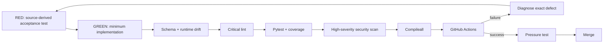

# Testing and Evaluation

Phase 1 development uses explicit red-green-refactor loops. Behavioral changes begin with an executable expectation, then the minimum implementation, then refactoring while preserving contracts and governance.

## Verification pipeline



## Release commands

```bash
python3 -m venv .venv
source .venv/bin/activate
pip install -e '.[dev]'
python -m pip check
python scripts/validate-contracts.py
python scripts/check-runtime-doc-drift.py
ruff check src tests scripts --select E9,F63,F7,F82
pytest --cov=mesh_cos --cov-report=term-missing --cov-fail-under=55
bandit -q -r src -lll
python -m compileall -q src
```

## Test layers

### Contracts

All nine schemas validate positive fixtures and reject malformed required-field fixtures. Final-closure tests additionally validate real runtime `TaskRecord`, `Delegation`, `AgentRecord`, and `AuditEvent` payloads against canonical schemas.

### State and authority

State-machine tests reject invalid lifecycle changes. Authority tests enforce L0-L5 boundaries, delegation depth, approval inheritance, source/tool allowlists, prompt-injection boundaries, and fail-closed consequential actions.

### Management services

Stateful tests exercise CoS intake, work decomposition, dependencies, reassignment, delegation, functional invocation, verification/rework, conflicts, approvals, Answer Desk, AgentOps, retries, timeouts, leases, metrics, and audit state.

### Source-derived final closure

The final TDD loop added tests for:

- AgentRecord timestamps and runtime contract parity,
- `event_version` in the canonical audit envelope,
- full material-conflict/source-authority records,
- Answer Desk routing, approval, and correction tracking,
- Slack freshness/replay rejection and separate Answer Desk Slack interface,
- AgentOps deadline/rework/error/tool/evidence signals and complete recommendations,
- partial-failure replay and explicit human override,
- the exact original Phase 1 instrumentation set,
- persistent delegated work and bounded portfolio recommendations,
- binding existing Mesh skills without reimplementation.

### Original 13 evaluation scenarios

The original scenarios remain in the suite: routine team question, pricing escalation, CRO/CFO conflict, infeasible staffing, stale consultant availability, content approval gate, WATCH after repeated poor work, QUARANTINE after critical defect, Slack duplicate delivery, coordination loop, missing source authority, high-impact/low-confidence escalation, and failed outcome verification returning to REWORK.

## Drift gate

`scripts/check-runtime-doc-drift.py` verifies schema closure/versioning, all runtime AgentRecords, representative Task/Delegation/AuditEvent payloads, `#mesh-agent-ops` configuration, and key documentation tokens. This prevents documentation from claiming a runtime state the code no longer supports.

## Test integrity

Tests must not fabricate production credentials, weaken authority or approval policy, turn Slack into canonical state, or claim an external integration is live when an injected adapter/stub is used.
