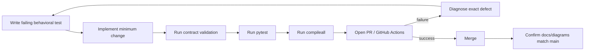

# Testing and Evaluation

Phase 1 development uses test-driven development with short red-green-refactor loops. Behavioral changes should begin with an executable failing expectation, then add the minimum implementation, then refactor while preserving the contract.

## Verification pipeline



## Local commands

```bash
python3 -m venv .venv
source .venv/bin/activate
pip install -e '.[dev]'
python scripts/validate-contracts.py
pytest
python -m compileall -q src
```

## Test layers

### Contract validation

All versioned JSON schemas and positive fixtures must validate. Contract changes require explicit compatibility review and corresponding runtime/test updates.

### Unit tests

Unit tests cover deterministic policy logic such as lifecycle transitions, authority classification, source permissions, prompt-injection boundaries, staffing freshness, performance scoring, and idempotency helpers.

### Stateful remediation tests

The Phase 1 remediation added stateful tests for:

- canonical runtime registry loading/normalization,
- durable consequential record persistence,
- CoS intake through explicit verification,
- failed acceptance routing to rework,
- delegation persistence and governance rules,
- conflict and decision persistence,
- Answer Desk disposition persistence,
- Slack signature verification, durable dedupe, and task/thread mapping,
- AgentOps versioned policy behavior,
- invocation-time registry authorization,
- governed functional adapter boundaries,
- bounded retry behavior,
- deterministic operating metrics.

### Required scenario coverage

The original Phase 1 evaluation scenarios remain part of the suite. New integration behavior should extend the scenario harness rather than replacing it with manual demonstrations.

## Red/green evidence from remediation

The prioritized remediation tests were committed before the implementation. CI then surfaced registry normalization defects. The code was corrected through successive loops until contract validation, the complete pytest suite, and compileall passed on the final PR head.

## Merge gate

Do not merge a behavior-changing PR while CI is failing. Documentation-only changes should still run the existing CI to detect accidental repository damage.

## What tests must not do

- They must not fabricate production credentials.
- They must not expand agent authority to make a test pass.
- They must not weaken approval requirements to avoid failure paths.
- They must not treat Slack or conversation text as canonical state.
- They must not claim an external source integration is live when the test uses a stub or adapter boundary.
