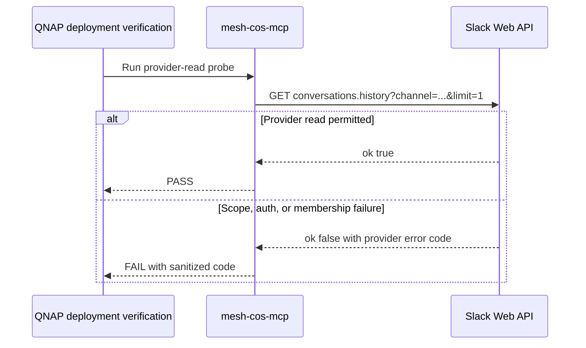

# Mesh CoS MCP v4.2.2 Verification

Status: **CANDIDATE, NOT YET VERIFIED**

Subject: `fix/v4.2.2-slack-provider-transport`
Base: v4.2.1 merge `7b312a7c0533f3c14520d7037662ed0502135f6f`
Canonical runtime contract: `4.0.0`
Security applicability: **TARGETED**

## Production RED evidence

The v4.2.1 production failure is reproducible and causal:

1. the running QNAP container's protected bot credential successfully retrieves the exact approval thread via GET/query `conversations.replies`;
2. the same credential and exact locators sent using v4.2.1 POST/JSON return Slack `invalid_arguments` with required `channel` and `ts` reported missing;
3. direct Python `SlackNativeTriggerApprovalService.reconcile()` fails in `_default_transport` before decision parsing;
4. canonical approval remains PENDING and no consequential action executes.

The repair is accepted only if the same provider-read contract becomes GET/query without weakening any authority checks.

## Deployment verification path

This Mermaid source was validated with Mermaid Chart during release preparation.

## Requirement-to-evidence matrix

| Requirement | Planned evidence | Classification before run |
| --- | --- | --- |
| `conversations.replies` uses GET/query | `test_slack_provider_transport_v422.py` request inspection | PENDING |
| OAuth token remains header-only | regression assertion token absent from URL | PENDING |
| Slack writes remain POST/JSON | `chat.postMessage` transport regression | PENDING |
| Provider error code sanitized | safe/unsafe error regression tests | PENDING |
| Provider metadata is not leaked | explicit exception-text regression | PENDING |
| Correct app ID `A0B49RNE4K0` | env/preflight/remote/QNAP drift tests | PENDING |
| Missing live `groups:history` or channel access blocks deployment | QNAP verify provider-read stage + shell/release tests | PENDING |
| Locator-only dispatcher contract unchanged | native trigger/governed adapter tests and docs audit | PENDING |
| v4.2.1 bold decision compatibility retained | native trigger parser regression | PENDING |
| Replay remains idempotent | native trigger replay test | PENDING |
| No Socket Mode/xapp regression | compose, scripts, release and security gates | PENDING |
| Full Python behavior remains green | full pytest at required coverage | PENDING |
| Type/lint/security compilation | Ruff, mypy, Bandit, compileall | PENDING |
| Node/MCP behavior remains green | npm check, contract and modern MCP smoke | PENDING |
| Immutable QNAP bundle and provenance | v4.2.2 bundle/checksum/container build | PENDING |
| Live Work-trigger acceptance | post-deploy production acceptance | BLOCKED UNTIL DEPLOYMENT |

## Verification sequence

1. Inspect the final diff against v4.2.1 and confirm patch scope is limited to provider transport, app-ID drift, deployment provider-read verification, tests, release plumbing and documentation.
2. Run targeted Slack transport, native trigger, governed adapter, production preflight and QNAP deployment tests.
3. Run the full Python suite with the repository coverage threshold.
4. Run Ruff, mypy, Bandit, compileall, contract validation, runtime/doc drift and ChatGPT package validation.
5. Run Node build/test/check gates.
6. Run QNAP shell/security checks and exact release-bundle construction.
7. Build the production container from the exact bundled build context and confirm release/revision labels.
8. Run modern MCP discovery, sequential request and tunnel-only ingress smoke tests.
9. Inspect the exact final diff and TARGETED security evidence.
10. Only after all repository gates pass, open/merge the release PR and publish immutable `v4.2.2`.
11. After QNAP deployment, rerun the live ChatGPT-native Slack acceptance matrix using fresh synthetic approvals.

## Production acceptance dependency

Repository verification cannot prove ChatGPT Work webhook delivery. A repository PASS therefore means release-candidate engineering verification only. Production HITL remains NOT ACCEPTED until the live v4.2.2 dispatcher path succeeds and all required negative cases fail closed.

## Final receipt

This document must be updated with exact final commit SHA, test counts, coverage, CI workflow/run evidence, release artifact SHA-256, security result and residual gaps before publication is called verified.
